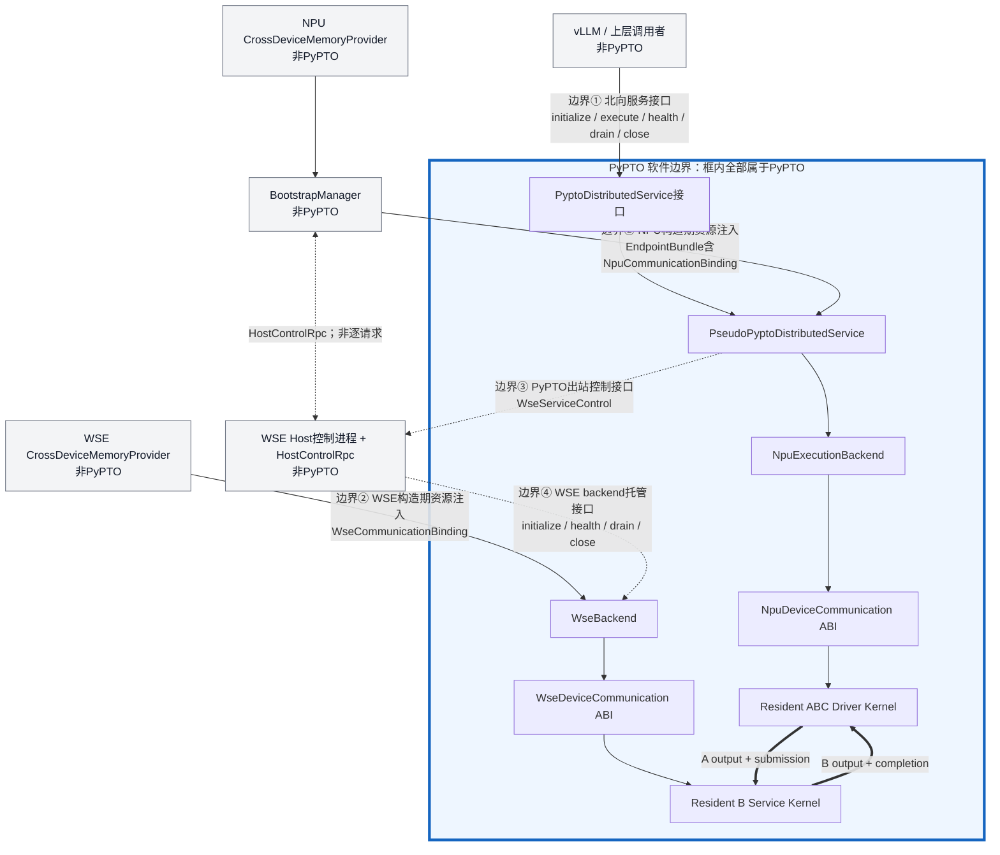

# PyPTO 对外接口设计

## 1. 目标

本文定义上层框架调用 PyPTO 分布式服务时看到的接口，以及外部 Bootstrap 子系统向 PyPTO
注入跨 Device 通信资源时使用的边界。设计目标是让 vLLM 等上层软件只感知一个由 NPU Host
承载的服务入口，不感知 WSE Host 进程、VMM handle、peer mapping 或 Device 通信协议。

当前代码是固定 `A(NPU) -> B(WSE) -> C(NPU)` 的同步原型，接口形态面向后续正式实现；
它不代表已经完成 vLLM `DistributedExecutor` 集成。

## 2. 接口分层



图中`PyPTO 软件边界`外框是明确的软件归属线：框内模块和Device kernel属于PyPTO；
框外的上层调用者、Bootstrap、memory provider、WSE Host控制进程和Host RPC均不属于PyPTO。
`EndpointBundle`、两侧`CommunicationBinding`和request/response是跨边界数据结构，因此只标在
连线上，不作为运行模块。

跨越该边界的接口只有四类：

1. 面向上层框架的服务接口：`PyptoDistributedService`。
2. 面向外部Bootstrap的构造期资源注入接口：NPU侧`EndpointBundle`和WSE侧
   `WseCommunicationBinding`。
3. PyPTO调用外部WSE控制面的出站接口：`WseServiceControl`。接口由PyPTO定义，
   `RemoteWseServiceControl`和`HostControlRpc`适配实现属于外部基础设施。
4. WSE Host控制进程托管PyPTO `WseBackend`的生命周期接口。控制进程负责创建和调用backend，
   backend及其resident kernel仍属于PyPTO。

`CrossDeviceMemoryProvider`不是PyPTO业务接口。它属于外部基础设施，用于生成binding。

## 3. 面向上层的软件接口

稳定服务协议定义在`pypto_test/pseudo_pypto/api.py`：

```python
class PyptoDistributedService(Protocol):
    def initialize(
        self,
        request: InitializeRequest | None = None,
    ) -> InitializeResponse: ...

    def execute(self, request: ExecuteRequest) -> ExecuteResponse: ...

    def health(self) -> HealthStatus: ...

    def drain(
        self,
        request: DrainRequest | None = None,
    ) -> DrainResponse: ...

    def close(self) -> None: ...
```

上层只依赖这些typed request/response，不直接调用NPU/WSE backend。

### 3.1 `initialize`

用途：验证服务构造资源和程序配置，启动WSE resident service与NPU resident driver，等待两端
Device READY。

当前请求：

```python
InitializeRequest(
    program=PseudoProgramSpec(...),
)
```

当前返回：

```python
InitializeResponse(
    generation=...,
    state=ServiceState.READY,
    driver_binary_sha256=...,
    driver_ready_poll_reads=...,
    program=...,
    remote=...,
    lifecycle=...,
)
```

语义约束：

- 只能在`NEW`状态调用一次。
- 返回成功表示NPU和WSE Device执行后端均已READY。
- 通信资源必须在构造服务前由Bootstrap完成注入。
- 初始化RPC不得携带模型请求数据。

### 3.2 `execute`

用途：向NPU Host服务入口提交一次完整PyPTO invocation。

当前请求：

```python
ExecuteRequest(payload: bytes)
```

当前返回：

```python
ExecuteResponse(
    result=ExecutionResult(
        generation=...,
        request_id=...,
        sequence=...,
        element_count=...,
        output=...,
        output_checksum=...,
        final_signal_poll_reads=...,
        final_control_d2h_bytes=...,
        final_payload_d2h_bytes=...,
    )
)
```

执行语义：

```text
Host payload
  -> PyPTO内部NPU H2D
  -> A(NPU)
  -> Device remote store到WSE
  -> B
  -> Device remote store回NPU
  -> C
  -> PyPTO内部NPU D2H
  -> ExecuteResponse
```

当前原型同步阻塞且`max_inflight=1`。调用期间Host不通过RPC推进A、B或C，也不读取中间结果。

### 3.3 `health`

用途：查询服务和两端执行后端是否仍处于可服务状态。

返回`HealthStatus`，包含：

- 当前generation。
- 当前服务状态。
- NPU backend与WSE backend的健康信息。

`health()`是generation级控制操作，不是逐请求completion接口。

### 3.4 `drain`

用途：停止接收新请求，并等待已接收工作和resident kernel有序停止。

当前原型没有并发请求，因此`drain()`只在`READY`状态调用。返回`DrainResponse`，包含NPU/WSE
执行报告和最终状态。

`drain()`完成后，PyPTO仍持有外部通信资源的lease；资源尚不能由上层提前释放。

### 3.5 `close`

用途：卸载PyPTO拥有的kernel并释放PyPTO本地Device内存，然后将`BootstrapLease`置为
`QUIESCED`。

正常顺序为：

```text
drain
  -> close PyPTO execution backends
  -> release PyPTO-local memory
  -> lease QUIESCED
  -> BootstrapManager.release external communication memory
```

`close()`不负责释放外部VMM mapping。

## 4. 服务状态机

```text
NEW
  -> INITIALIZING
  -> READY
  -> EXECUTING
  -> READY
  -> DRAINING
  -> DRAINED
  -> CLOSED
```

主要调用约束：

| 接口 | 允许的起始状态 | 成功后的状态 |
| --- | --- | --- |
| `initialize` | `NEW` | `READY` |
| `execute` | `READY` | `READY` |
| `health` | 已初始化状态 | 不改变 |
| `drain` | `READY` | `DRAINED` |
| `close` | `READY`或`DRAINED` | `CLOSED` |

当前只验证正常路径。正式实现还需定义超时、取消、部分初始化失败和重复请求的错误类型及幂等规则。

## 5. 构造期资源注入接口

### 5.1 `EndpointBundle`

`EndpointBundle`描述在NPU Host入口创建一个PyPTO Service所需的外部资源集合：

```python
EndpointBundle(
    generation=...,
    endpoint_id=...,
    backend_kind=...,
    transport_kind=...,
    transport_scope=...,
    layout=...,
    npu_communication=NpuCommunicationBinding(...),
    wse_control=WseServiceControl(...),
    lease=BootstrapLease(...),
)
```

字段含义：

| 字段 | 含义 |
| --- | --- |
| `generation` | 当前服务实例和通信资源代次 |
| `endpoint_id` | NPU Host服务入口的逻辑标识 |
| `backend_kind` | WSE执行后端类型 |
| `transport_kind` | Device数据面的类型，例如`ASCEND_VMM_P2P` |
| `transport_scope` | 当前验证范围，例如`HOST_LOCAL` |
| `layout` | 固定通信ABI的大小和版本 |
| `npu_communication` | NPU进程内有效的local/peer shared地址 |
| `wse_control` | WSE generation级生命周期控制能力 |
| `lease` | 外部通信资源的借用期限 |

它不包含：

- `CrossDeviceMemoryProvider`。
- VMM allocator或release方法。
- raw shareable handle。
- H2D/D2H能力。
- kernel launch能力。

### 5.2 对等的Device通信上下文

NPU和WSE分别获得逻辑对等的binding：

```python
NpuCommunicationBinding(
    generation,
    local_shared_base,
    local_shared_bytes,
    peer_shared_base,
    peer_shared_bytes,
)

WseCommunicationBinding(
    generation,
    local_shared_base,
    local_shared_bytes,
    peer_shared_base,
    peer_shared_bytes,
)
```

两者字段和生命周期一致，但地址只在各自Host进程有效。禁止将WSE进程的VA作为数值传给NPU
进程使用，反之亦然。

两侧分别将binding转换为固定Device ABI：

```text
NpuDeviceCommunication
  local B output/completion
  remote WSE B input/submission

WseDeviceCommunication
  local B input/submission
  remote NPU B output/completion
```

`EndpointBundle`只存在于NPU服务入口；WSE侧直接将`WseCommunicationBinding`交给
`WseBackend`。这是服务编排的不对称，不影响Device通信上下文的对等性。

### 5.3 `BootstrapLease`

Lease状态为：

```text
CREATED -> BORROWED -> QUIESCED -> RELEASED
```

- `BORROWED`：PyPTO可以访问binding中的地址。
- `QUIESCED`：PyPTO kernel和本地资源已停止使用这些地址。
- `RELEASED`：Bootstrap已解除mapping并释放物理内存。

Lease是Host生命周期约束，不参与Device通信。

## 6. 外部Bootstrap接口

Bootstrap不属于PyPTO，但必须满足PyPTO的资源前置条件。当前初始化顺序为：

```python
bootstrap.launch_wse_host(...)
bootstrap.launch_npu_host()
endpoint_bundle = bootstrap.build_communication()

service = PseudoPyptoDistributedService(endpoint_bundle, ...)
service.initialize()
```

两端provider创建方法保持对称：

```python
create_npu_memory_provider(device_id, generation)
create_wse_memory_provider(device_id, generation)
```

两端通信构建方法也使用相同概念：

```python
build_npu_communication(provider, rpc)
build_wse_communication(provider, peer_manifest)
```

各自都执行：

```text
allocate local shared window
  -> exchange manifest
  -> attach peer
  -> produce process-local binding
```

两侧差异仅在于NPU Host是manifest交换的发起方，WSE Host是RPC接收方。

## 7. `CrossDeviceMemoryProvider`边界

外部provider接口为：

```python
initialize_host()
allocate_shared_window() -> WindowManifest
attach_peer(peer_manifest)
binding(peer_manifest) -> CrossDeviceMemoryBinding
release()
evidence()
```

PyPTO只消费`binding()`的结果，不调用provider，也不感知`attach_peer()`。

| Provider负责 | PyPTO负责 |
| --- | --- |
| ACL初始化、Device选择 | PyPTO本地Device内存 |
| VMM物理内存与VA mapping | 输入H2D和最终D2H |
| handle导出、交换和导入 | resident kernel |
| peer access和访问权限 | descriptor/signal/fence协议 |
| 外部通信内存释放 | Device远端读写 |

## 8. Manifest交换接口

Manifest包含：

| 字段 | 含义 |
| --- | --- |
| `endpoint_id` | 内存所有者的逻辑端点 |
| `role` | `ATTENTION`或`WSE` |
| `device_id` | 物理内存所属Device |
| `generation` | 资源代次 |
| `buffer_id` | shared window逻辑名称 |
| `logical_bytes` | Device协议实际使用大小 |
| `mapping_bytes` | 按VMM粒度对齐后的映射大小 |
| `shareable_handle` | 对端导入物理内存所需的opaque handle |
| `layout_hash` | 两端通信布局兼容性摘要 |

Manifest不包含进程本地Device VA、模型输入输出或逐请求状态。当前shareable handle只验证了
同Host跨进程使用；跨Host场景需要由新的provider和rendezvous实现验证其可传递形式。

## 9. vLLM适配关系

建议由独立adapter连接vLLM和PyPTO，避免PyPTO核心代码依赖vLLM类型：

| vLLM/Executor操作 | Adapter行为 | PyPTO接口 |
| --- | --- | --- |
| `_init_executor` | 请求外部完成placement和Bootstrap，再构造服务 | `initialize` |
| `execute_model` | 将vLLM请求转换为PyPTO请求并转换返回结果 | `execute` |
| 健康检查 | 转换健康状态 | `health` |
| 停止接收请求 | 等待in-flight完成 | `drain` |
| Executor析构 | 关闭PyPTO后通知Bootstrap释放资源 | `close` |

`collective_rpc`或Ray worker RPC只能承担Host控制和初始化，不能替代PyPTO Device数据面。

## 10. 后续正式化要求

当前接口还需要在正式实现阶段补充：

- `ExecuteRequest`从raw bytes扩展为tensor/device-buffer descriptor时的所有权规则。
- 异步请求handle、并发、backpressure、取消和超时。
- 动态shape、dtype、batch和多通信slot协议。
- 结构化错误码、可重试性和幂等语义。
- 真实WSE backend能力协商和版本协商。
- 跨Host rendezvous、认证、handle安全性和故障回收。
- vLLM `DistributedExecutor` adapter的实际签名与测试。

这些扩展不应改变核心边界：外部基础设施创建跨Device可访问内存，PyPTO只借用地址并负责
任务、Device通信、输入H2D和最终结果D2H。
