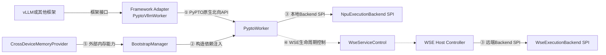

# PyPTO 对外接口与 NPU/WSE 部署架构设计

## 1. 目标和范围

本文定义以下内容：

- 1 个 Attention NPU 与 1 个 FFN WSE 组成的 PyPTO 分布式服务部署架构；
- PyPTO 面向 vLLM 等上层框架适配层的原生 Worker API；
- NPU/WSE Host ExecutionBackend SPI；
- 外部 Bootstrap 向 PyPTO 注入跨 Device 通信资源的边界；
- 初始化、服务启动、请求执行、健康检查和关闭流程。

正式北向接口不是 vLLM API。vLLM 通过 `PyptoVllmWorker` 适配 `PyptoWorker`；其他框架可以
实现自己的 Adapter。`PyptoWorker`及其Backend只使用PyPTO原生语义和数据结构。

当前代码仍是固定 `A(NPU) -> B(WSE) -> C(NPU)`、同步单请求的穿刺原型。正式场景中，A/C
代表NPU侧Attention计算，B代表WSE侧FFN计算。

## 2. NPU/WSE部署软件架构

### 2.1 1:1部署模块架构

```mermaid
flowchart LR
    subgraph NPU_HOST["NPU Host：同一服务进程"]
        direction TB

        subgraph NPU_FRAMEWORK["上层框架适配"]
            VLLM["vLLM"]
            VADAPTER["PyptoVllmWorker<br/>完整vLLM Worker适配器"]
            VLLM --> VADAPTER
        end

        subgraph NPU_PYPTO_HOST["PyPTO Host侧"]
            PWORKER["PyptoWorker<br/>PyPTO原生服务入口"]
            NBACKEND["NpuExecutionBackend<br/>Host ExecutionBackend"]
            WCONTROL["WseServiceControl Client"]
            PWORKER --> NBACKEND
            PWORKER -.-> WCONTROL
        end

        subgraph NPU_EXTERNAL["外部基础设施"]
            BOOTSTRAP["BootstrapManager"]
            NPROVIDER["NPU CrossDeviceMemoryProvider"]
            BOOTSTRAP --> NPROVIDER
        end

        VADAPTER -->|"PyPTO原生API"| PWORKER
        BOOTSTRAP -->|"NPU binding + control + lease"| PWORKER
    end

    subgraph NPU_DEVICE["NPU Device"]
        direction TB
        subgraph NDEVICE_BACKEND["NpuDeviceBackend：PyPTO Device侧"]
            NORCH["PyPTO Orchestrator<br/>构造/启动真实图程序"]
            NSCHED["PyPTO Scheduler<br/>依赖与任务调度"]
            NL0["NPU L0 Device Worker"]
            ATTN["Attention A / C"]
            NCOMM["Device Communication能力"]

            NORCH --> NSCHED
            NSCHED -->|"本地任务"| NL0
            NL0 --> ATTN
            NSCHED -->|"远端FFN任务"| NCOMM
            NCOMM -->|"远端completion"| NSCHED
        end
    end

    subgraph WSE_HOST["WSE Host：同一控制进程"]
        direction TB

        subgraph WSE_EXTERNAL["外部控制与资源基础设施"]
            RPCSERVER["HostControlRpcServer"]
            WHOST["WSE Host控制器"]
            WPROVIDER["WSE CrossDeviceMemoryProvider"]
            RPCSERVER --> WHOST
            WHOST --> WPROVIDER
        end

        subgraph WSE_PYPTO_HOST["PyPTO Host侧"]
            WBACKEND["WseExecutionBackend<br/>Host ExecutionBackend"]
        end

        WHOST -->|"Backend SPI调用"| WBACKEND
    end

    subgraph WSE_DEVICE["WSE Device"]
        direction TB
        subgraph WDEVICE_BACKEND["WseDeviceBackend：PyPTO Device侧"]
            WL0["WSE L0 Device Worker"]
            FFN["FFN B"]
            WCOMM["Device Communication能力"]

            WCOMM -->|"远端任务"| WL0
            WL0 --> FFN
            FFN -->|"发布结果"| WCOMM
        end
    end

    NBACKEND -->|"Device Runtime控制"| NDEVICE_BACKEND
    WBACKEND -->|"Device Runtime控制"| WDEVICE_BACKEND
    WCONTROL -.->|"HostControlRpc：生命周期"| RPCSERVER
    BOOTSTRAP <-.->|"manifest/建链控制"| RPCSERVER
    NCOMM ==>|"A输出/submission"| WCOMM
    WCOMM ==>|"B输出/completion"| NCOMM

    style NPU_PYPTO_HOST fill:#eef6ff,stroke:#1565c0,stroke-width:2px
    style WSE_PYPTO_HOST fill:#eef6ff,stroke:#1565c0,stroke-width:2px
    style NDEVICE_BACKEND fill:#e8f5e9,stroke:#2e7d32,stroke-width:2px
    style WDEVICE_BACKEND fill:#e8f5e9,stroke:#2e7d32,stroke-width:2px
    style NPU_EXTERNAL fill:#f5f5f5,stroke:#6b7280
    style WSE_EXTERNAL fill:#f5f5f5,stroke:#6b7280
```



图中有三个必须区分的概念：

1. `ExecutionBackend`是Host侧模块，负责Device程序加载、启动、监控和Host数据入口。
2. `DeviceBackend`是Device侧PyPTO运行时，不属于上层软件可见的对外接口。
3. L0 Worker是Device Worker，不等同于Host侧`ExecutionBackend`。

Device Communication也不是独立Host模块。它属于两侧`DeviceBackend`内部能力，由Device侧
Scheduler/L0 Worker使用注入的通信地址完成远端任务提交和completion。

### 2.2 模块职责

| 模块 | 部署位置 | 职责 |
| --- | --- | --- |
| `PyptoVllmWorker` | NPU Host服务进程 | vLLM看到的完整Worker；只转换数据类型和转发调用 |
| `PyptoWorker` | NPU Host服务进程 | PyPTO原生服务入口，协调两侧Host Backend |
| `NpuExecutionBackend` | NPU Host服务进程 | 控制NPU DeviceBackend，完成H2D、请求下发、最终D2H |
| `NpuDeviceBackend` | NPU Device | 运行Orchestrator、Scheduler、NPU L0 Worker和Attention A/C |
| WSE Host控制器 | WSE Host控制进程 | 管理WSE Backend的prepare/execute/health/drain/close |
| `WseExecutionBackend` | WSE Host控制进程 | 控制WSE DeviceBackend，不提供Host侧逐请求入口 |
| `WseDeviceBackend` | WSE Device | 运行WSE L0 Worker和FFN B服务 |
| Device Communication | 两侧DeviceBackend内部 | 提交远端任务、传输中间数据、发布和感知completion |
| `BootstrapManager` | NPU Host外部基础设施 | 拉起两侧Host、建立数据面、注入和释放资源 |
| 两侧MemoryProvider | 对应Host进程 | ACL/Device/VMM/handle/VA/Peer Access管理 |
| `HostControlRpc` | 两个Host控制面之间 | manifest交换与generation级生命周期调用 |

### 2.3 Host接口与Device内部实现

上层软件只能感知Host侧接口：

```text
PyptoVllmWorker
  -> PyptoWorker API
  -> NpuExecutionBackend SPI / WseServiceControl
  -> WSE Host Controller
  -> WseExecutionBackend SPI
```

以下内容只出现在内部部署和执行流程中，不作为北向接口暴露：

- NPU/WSE DeviceBackend；
- Orchestrator和Scheduler内部对象；
- L0 Device Worker；
- Device Communication操作；
- submission/completion queue和fence细节；
- Attention/FFN Device kernel。

## 3. Host侧接口架构

### 3.1 接口关系



接口分类如下。

| 类别 | 提供方 | 使用方 | 作用 |
| --- | --- | --- | --- |
| PyPTO原生Worker API | `PyptoWorker` | 各框架Adapter | 初始化服务、启动一代服务、下发请求和管理生命周期 |
| 构造依赖注入 | 外部Bootstrap | `PyptoWorker` | 交付NPU通信binding、WSE控制能力和lease |
| Host ExecutionBackend SPI | PyPTO定义、具体Host Backend实现 | `PyptoWorker`或WSE Host控制器 | 控制对应DeviceBackend |
| `WseServiceControl` | RPC Adapter实现 | `PyptoWorker` | 跨Host控制WSE generation生命周期 |
| 外部基础设施API | Bootstrap、Provider、RPC | 部署与资源管理代码 | 创建并管理跨Device通信能力 |

## 4. 框架适配层

### 4.1 `PyptoVllmWorker`

`PyptoVllmWorker`采用完整Worker集成方案：vLLM把它看作一次完整模型执行的Worker。它与
`PyptoWorker`、`NpuExecutionBackend`首版部署在同一个NPU Host进程中。

它只负责：

- 将vLLM配置转换成PyPTO配置或程序描述；
- 将vLLM请求转换成`PyptoRequest`；
- 将`PyptoResult`转换成vLLM Worker返回类型；
- 转发初始化、服务启动、请求执行和关闭操作。

它不得分配跨Device内存、实现图调度、直接调用WSE Host RPC，或绕过`PyptoWorker`访问Backend。

关键映射如下。

| vLLM Worker阶段 | `PyptoVllmWorker`行为 | PyPTO调用 |
| --- | --- | --- |
| `init_device()` | 转换初始化配置和已注入依赖 | `PyptoWorker.initialize()` |
| `determine_available_memory()` | 转换容量结果 | `PyptoWorker.query_capacity()` |
| 模型加载/执行准备 | 转换或取得已经生成的PyPTO图程序；启动一代服务 | `PyptoWorker.execute(program)` |
| `execute_model()` | 转换一次请求和结果 | `PyptoWorker.send_req(request)` |
| 健康检查 | 转换健康状态 | `PyptoWorker.health()` |
| `shutdown()` | 转发生命周期操作 | `drain()`、`close()` |

`execute_model()`不能映射到`PyptoWorker.execute()`。前者是逐请求调用，必须映射到
`send_req()`；`execute(program)`每代服务只调用一次。

## 5. PyPTO原生北向API

### 5.1 `PyptoWorker`

原 `PyptoDistributedService` 正式命名为 `PyptoWorker`。它是所有上层Adapter共用的唯一PyPTO
原生入口，不引用 `SchedulerOutput`、`ModelRunnerOutput` 等vLLM类型。

```python
class PyptoWorker(Protocol):
    def initialize(
        self,
        config: PyptoWorkerConfig,
        dependencies: PyptoWorkerDependencies,
    ) -> PyptoInitializeResult: ...

    def query_capacity(self) -> PyptoCapacity: ...

    def execute(
        self,
        program: PyptoProgram,
    ) -> PyptoServiceStartResult: ...

    def send_req(
        self,
        request: PyptoRequest,
    ) -> PyptoResult: ...

    def health(self) -> PyptoHealthStatus: ...
    def drain(self) -> PyptoDrainResult: ...
    def close(self) -> None: ...
```

### 5.2 接口语义

| 接口 | 调用频率 | 功能和边界 |
| --- | --- | --- |
| `initialize` | 每代一次 | 注入资源，构造并初始化两侧Host Backend；不启动业务图 |
| `query_capacity` | 按需 | 查询两侧可用内存、执行槽或程序容量 |
| `execute(program)` | 每代一次 | 加载图程序，启动两侧DeviceBackend及常驻运行组件，等待服务READY |
| `send_req(request)` | 每请求一次 | 向已启动服务下发输入和请求参数，等待并返回最终结果 |
| `health` | 按需 | 查询Worker及两侧Backend的generation级状态 |
| `drain` | 每代至多一次 | 停止接收请求，等待in-flight完成并停止两侧DeviceBackend |
| `close` | 每代一次 | 释放PyPTO本地资源并放弃通信资源使用权，不释放外部VMM资源 |

`execute(program)`启动以下常驻组件：

- WSE侧WSE L0 Device Worker和FFN B服务；
- NPU侧Orchestrator、Scheduler、NPU L0 Device Worker及Attention A/C程序；
- 两侧DeviceBackend内部的Device Communication能力。

后续多个`send_req()`复用同一套运行环境。`send_req()`只携带本次输入和请求参数；支持多个
已加载程序时，可以携带`program_handle`，不能重复下发完整程序。

### 5.3 原生数据类型

```python
PyptoWorkerConfig
PyptoWorkerDependencies
PyptoCommunicationResources
PyptoProgram
PyptoProgramHandle
PyptoCapacity
PyptoServiceStartResult
PyptoRequest
PyptoResult
PyptoHealthStatus
PyptoDrainResult
```

`PyptoRequest`可以包含request id、输入dtype/shape、输入payload或PyPTO buffer descriptor、
执行参数和可选`program_handle`。它不能包含vLLM专用对象或外部allocator。

### 5.4 Worker状态机

```text
NEW
  -> INITIALIZING
  -> INITIALIZED
  -> STARTING            execute(program)，每代只允许一次
  -> RUNNING
  -> RUNNING             send_req(request)，可调用多次
  -> DRAINING
  -> DRAINED
  -> CLOSED
```

调用约束：

| 接口 | 允许的状态 | 成功后的状态 |
| --- | --- | --- |
| `initialize` | `NEW` | `INITIALIZED` |
| `query_capacity` | `INITIALIZED`及之后 | 不改变 |
| `execute` | `INITIALIZED` | `RUNNING` |
| `send_req` | `RUNNING` | `RUNNING` |
| `health` | 已初始化状态 | 不改变 |
| `drain` | `RUNNING` | `DRAINED` |
| `close` | `INITIALIZED`或`DRAINED` | `CLOSED` |

## 6. 构造依赖与通信资源注入

### 6.1 依赖交付形式

`initialize()`接收Host侧构造依赖，但不接收资源分配器：

```python
PyptoWorkerDependencies(
    communication=PyptoCommunicationResources(
        generation=...,
        endpoint_id=...,
        transport_kind=...,
        transport_scope=...,
        communication_layout=...,
        npu_communication=NpuCommunicationBinding(...),
    ),
    wse_control=WseServiceControl(...),
    lease=BootstrapLease(...),
)
```

三个字段必须分开理解：

| 字段 | 性质 | 含义 |
| --- | --- | --- |
| `communication` | 数据资源 | NPU侧Backend可直接使用的Device通信地址和布局 |
| `wse_control` | Host控制能力 | WSE generation生命周期调用入口 |
| `lease` | 所有权约束 | 表示PyPTO借用外部通信资源，不获得释放权 |

当前代码中的`EndpointBundle`是上述三部分的合并原型。依赖中不包含Provider、VMM allocator、
raw shareable handle、`attach_peer/release`方法、Host H2D/D2H工具或kernel launch工具。

### 6.2 两侧对等Binding

外部Bootstrap为两侧分别生成进程本地有效的binding：

```python
NpuCommunicationBinding(
    generation,
    local_shared_base,
    local_shared_bytes,
    peer_shared_base,
    peer_shared_bytes,
)

WseCommunicationBinding(
    generation,
    local_shared_base,
    local_shared_bytes,
    peer_shared_base,
    peer_shared_bytes,
)
```

两者字段和生命周期对等，但虚拟地址只在各自Host进程和Device上下文中有效。NPU binding注入
`NpuExecutionBackend`，WSE binding由WSE Host控制器注入`WseExecutionBackend`。

Host ExecutionBackend再把本侧binding解析为DeviceBackend可使用的固定地址、窗口布局和
通信描述符。Device Communication属于DeviceBackend，不属于资源Provider。

### 6.3 `BootstrapLease`

```text
CREATED -> BORROWED -> QUIESCED -> RELEASED
```

- `BORROWED`：PyPTO可以访问binding中的地址。
- `QUIESCED`：两侧DeviceBackend和Host Backend已停止访问这些地址。
- `RELEASED`：Bootstrap已经解除mapping并释放物理资源。

## 7. Host ExecutionBackend SPI

SPI（Service Provider Interface）由PyPTO定义、由具体Host设备后端实现。SPI用于控制
DeviceBackend，不是上层框架接口。

### 7.1 通用生命周期

```python
class ExecutionBackend(Protocol):
    def initialize(
        self,
        config: BackendConfig,
        binding: CommunicationBinding,
    ) -> BackendInitializeResult: ...

    def query_capacity(self) -> BackendCapacity: ...
    def prepare(self, program: DeviceProgram) -> BackendPrepareResult: ...
    def execute(self) -> BackendReady: ...
    def health(self) -> BackendHealth: ...
    def drain(self) -> BackendDrainResult: ...
    def close(self) -> None: ...
```

- `initialize()`：绑定Host Runtime和外部通信地址，但不启动业务DeviceBackend。
- `prepare(program)`：加载本侧Device程序并准备PyPTO本地执行内存。
- `execute()`：启动本侧DeviceBackend和常驻组件，等待READY；每代只调用一次。
- `health/drain/close()`：管理本侧DeviceBackend生命周期。

### 7.2 `NpuExecutionBackend`

```python
class NpuExecutionBackend(ExecutionBackend, Protocol):
    def send_req(self, request: PyptoRequest) -> PyptoResult: ...
```

`NpuExecutionBackend.execute()`启动：

- NPU DeviceBackend；
- PyPTO Orchestrator；
- PyPTO Scheduler；
- NPU L0 Device Worker；
- Attention A/C程序。

`send_req()`是唯一Host请求入口，负责输入H2D、向Device Orchestrator发布请求、等待最终
completion并执行结果D2H。

### 7.3 `WseExecutionBackend`

```python
class WseExecutionBackend(ExecutionBackend, Protocol):
    backend_kind: str
```

`WseExecutionBackend.execute()`启动WSE DeviceBackend、WSE L0 Device Worker和FFN B服务。
它没有Host侧`send_req()`。每次远端FFN任务都由NPU Device Scheduler通过两侧DeviceBackend
内部的Device Communication提交。

当前`WseBackend`使用第二张NPU模拟WSE；真实WSE实现应保持相同Host SPI，并替换内部
WSE DeviceBackend和设备Runtime实现。

## 8. WSE Host控制接口

### 8.1 定位

WSE Host控制器与`WseExecutionBackend`部署在同一个WSE Host进程。控制器负责实际调用WSE
Backend的`prepare/execute/health/drain/close`。`PyptoWorker`通过`WseServiceControl`发起这些
generation级控制操作。

三者关系为：

```text
WseServiceControl            PyPTO需要的控制语义
  -> HostControlRpc          外部跨Host传输实现
  -> WSE Host Controller     WSE生命周期所有者
  -> WseExecutionBackend     PyPTO Host Backend SPI实现
  -> WseDeviceBackend        Device内部实现
```

### 8.2 接口设计

```python
class WseServiceControl(Protocol):
    def initialize(self, request: WseInitializeRequest) -> WseInitializeResult: ...
    def query_capacity(self) -> BackendCapacity: ...
    def prepare(self, program: WseDeviceProgram) -> BackendPrepareResult: ...
    def execute(self) -> BackendReady: ...
    def health(self) -> BackendHealth: ...
    def drain(self) -> BackendDrainResult: ...
    def close(self) -> None: ...
```

该接口没有`send_req()`。控制调用可以包含generation、程序描述和生命周期参数，但禁止包含
模型输入、Attention/FFN中间Tensor或逐请求completion。

当前原型把正式接口中的`prepare()`和`execute()`合并为`start()`。

## 9. 外部基础设施

本章接口均不属于PyPTO公共API。

### 9.1 `BootstrapManager`

```python
bootstrap.launch_wse_host(...)
bootstrap.launch_npu_host()
dependencies = bootstrap.build_communication()
```

- `launch_wse_host()`：拉起WSE Host控制进程并完成非通信初始化。
- `launch_npu_host()`：完成NPU Host侧非通信初始化。
- `build_communication()`：分配两侧窗口、交换manifest、attach peer并生成两侧binding。
- `release()`：仅在PyPTO进入quiesced状态后解除mapping并释放资源。

### 9.2 `CrossDeviceMemoryProvider`

```python
class CrossDeviceMemoryProvider(Protocol):
    def initialize_host(self) -> None: ...
    def allocate_shared_window(self) -> WindowManifest: ...
    def attach_peer(self, peer: WindowManifest) -> None: ...
    def binding(self, peer: WindowManifest) -> CrossDeviceMemoryBinding: ...
    def release(self) -> None: ...
```

Provider负责ACL初始化、Device选择、VMM分配、handle导入导出、VA map、Peer Access和释放。
PyPTO不获得Provider对象，只消费最终binding。

### 9.3 Manifest与rendezvous

`WindowManifest`至少包含：

| 字段 | 含义 |
| --- | --- |
| `endpoint_id` | 内存所有者的逻辑端点 |
| `role` | `ATTENTION`或`WSE` |
| `device_id` | 物理内存所属Device |
| `generation` | 资源代次 |
| `buffer_id` | shared window逻辑名称 |
| `logical_bytes` | Device协议实际使用大小 |
| `mapping_bytes` | 按VMM粒度对齐后的大小 |
| `shareable_handle` | 对端导入物理内存需要的opaque handle |
| `layout_hash` | 两端布局兼容性摘要 |

Manifest不包含进程本地VA、模型输入输出或逐请求状态。当前只验证同Host双进程handle交换；
跨Host仍需验证handle传递、rendezvous和Device直接互访能力。

### 9.4 外部能力、资源注入和Backend的关系

```text
CrossDeviceMemoryProvider
  -> 创建跨Device通信内存和互访能力
  -> 生成两侧CommunicationBinding
  -> Bootstrap分别注入两侧Host ExecutionBackend
  -> Host ExecutionBackend配置本侧DeviceBackend
  -> DeviceBackend内部Device Communication执行远端读写
```

外部能力创建并拥有资源；注入契约交付资源；Host Backend启动DeviceBackend；DeviceBackend使用
地址完成运行时通信。

## 10. 执行流程

### 10.1 总体流程

```text
Bootstrap建立通信资源
  -> PyptoWorker.initialize()
  -> PyptoWorker.execute(program)        每代一次
  -> PyptoWorker.send_req(request)       每请求一次，可多次
  -> health()                            按需
  -> drain()
  -> close()
  -> Bootstrap.release()
```

### 10.2 外部Bootstrap与通信数据面建立

```python
bootstrap = BootstrapManager(npu_device, wse_device, generation)
bootstrap.launch_wse_host()
bootstrap.launch_npu_host()
dependencies = bootstrap.build_communication()
```

`build_communication()`内部伪码：

```python
def build_communication():
    npu_manifest = npu_provider.allocate_shared_window()

    wse_reply = host_rpc.call(
        "BUILD_COMMUNICATION",
        peer_manifest=npu_manifest,
    )
    wse_manifest = wse_reply.manifest

    # WSE Host进程已执行：
    # wse_manifest = wse_provider.allocate_shared_window()
    # wse_provider.attach_peer(npu_manifest)
    # wse_binding = wse_provider.binding(npu_manifest)

    npu_provider.attach_peer(wse_manifest)
    npu_binding = npu_provider.binding(wse_manifest)

    return PyptoWorkerDependencies(
        communication=PyptoCommunicationResources(
            npu_communication=npu_binding,
            ...,
        ),
        wse_control=RemoteWseServiceControl(host_rpc),
        lease=BootstrapLease.borrow(),
    )
```

该阶段只建立通信能力，不启动PyPTO图程序。两侧Provider继续持有VMM资源，WSE Host控制器持有
WSE binding，NPU binding随dependencies注入`PyptoWorker`。

### 10.3 PyPTO Host侧初始化

```python
pypto_worker = PyptoWorker()
pypto_worker.initialize(pypto_config, dependencies)
```

内部接口调用：

```python
def initialize(config, dependencies):
    require_state(NEW)
    validate_generation(config, dependencies)

    npu_backend.initialize(
        config.npu_backend,
        dependencies.communication.npu_communication,
    )

    # RPC到WSE Host控制器；控制器调用WseExecutionBackend.initialize()。
    dependencies.wse_control.initialize(config.wse_backend)

    state = INITIALIZED
```

此时只完成Host Backend及通信地址绑定，Orchestrator、Scheduler和L0 Worker尚未启动。

### 10.4 一代服务启动：`execute(program)`

```python
start_result = pypto_worker.execute(attention_ffn_program)
```

`execute()`每代只调用一次：

```python
def execute(program):
    require_state(INITIALIZED)
    state = STARTING

    # 将同一张分布式图拆成本侧Device程序。
    npu_program = program.for_npu()   # Orchestrator/Scheduler + Attention A/C
    wse_program = program.for_wse()   # WSE L0 Worker + FFN B

    npu_backend.prepare(npu_program)
    dependencies.wse_control.prepare(wse_program)

    # 先启动远端FFN服务，避免NPU Scheduler启动后远端尚未READY。
    wse_ready = dependencies.wse_control.execute()
    npu_ready = npu_backend.execute()

    verify_same_generation(npu_ready, wse_ready)
    verify_program_and_abi(npu_ready, wse_ready)
    state = RUNNING

    return PyptoServiceStartResult(
        generation=generation,
        program_handle=program.handle,
        npu=npu_ready,
        wse=wse_ready,
    )
```

WSE Host侧调用链：

```python
def WseHostController.prepare(wse_program):
    return wse_backend.prepare(wse_program)


def WseHostController.execute():
    # 启动WseDeviceBackend、WSE L0 Worker和FFN B服务。
    return wse_backend.execute()
```

NPU Host侧`npu_backend.execute()`启动`NpuDeviceBackend`、Orchestrator、Scheduler、NPU L0 Worker
和Attention A/C程序。两端全部READY后，服务才能接收`send_req()`。

### 10.5 vLLM请求适配

```python
class PyptoVllmWorker:
    def execute_model(self, scheduler_output):
        request = PyptoRequest.from_vllm(scheduler_output)
        result = self.pypto_worker.send_req(request)
        return VllmWorkerOutput.from_pypto(result)
```

Adapter只做类型转换和调用转发，不调用Bootstrap、WSE控制接口或Backend SPI。

### 10.6 单次请求：`send_req(request)`

```python
def PyptoWorker.send_req(request):
    require_state(RUNNING)
    validate_program_handle(request.program_handle)
    return npu_backend.send_req(request)
```

NPU Host Backend执行：

```python
def NpuExecutionBackend.send_req(request):
    validate_request(request)

    # PyPTO自行完成输入H2D。
    copy_host_to_npu(local_input_address, request.payload)
    publish_request_to_device_orchestrator(request)

    # Host不参与A/B/C中间推进。
    wait_until_final_completion(request.request_id)

    output = copy_npu_to_host(final_output_address, request.output_bytes)
    return PyptoResult(request.request_id, output)
```

NPU Device Orchestrator使用`execute(program)`阶段加载的真实图程序，本次只绑定请求输入并提交图：

```text
PyPTO Orchestrator构造/打开本次invocation
  -> Scheduler使Attention A进入READY
  -> NPU L0 Worker执行Attention A
  -> NPU Device Communication提交Remote FFN Task和A输出
  -> WSE Device Communication通知WSE L0 Worker
  -> WSE L0 Worker执行FFN B并回写结果/completion
  -> NPU Scheduler感知远端completion并释放Attention C依赖
  -> NPU L0 Worker执行Attention C
  -> NPU DeviceBackend发布最终completion
```

运行时不存在`WseServiceControl.send_req()`或`WseExecutionBackend.send_req()`，也没有逐请求Host
RPC。所有A→B→C依赖推进、远端任务提交和completion处理都发生在Device侧。

### 10.7 健康检查

```python
def health():
    return PyptoHealthStatus(
        state=state,
        npu=npu_backend.health(),
        # WSE Host控制器调用WseExecutionBackend.health()。
        wse=dependencies.wse_control.health(),
    )
```

健康检查是generation级控制操作，不能用作逐请求completion轮询。

### 10.8 Drain、关闭和外部释放

```python
pypto_worker.drain()
pypto_worker.close()
bootstrap.release()
```

内部顺序：

```python
def drain():
    stop_accepting_send_req()
    wait_for_inflight_requests()

    npu_report = npu_backend.drain()
    # WSE Host控制器负责执行WSE Backend drain。
    wse_report = dependencies.wse_control.drain()

    state = DRAINED
    return PyptoDrainResult(npu_report, wse_report)


def close():
    require_state(INITIALIZED, DRAINED)
    dependencies.wse_control.close()
    npu_backend.close()
    dependencies.lease.quiesce()
    state = CLOSED


def BootstrapManager.release():
    require(dependencies.lease.state == QUIESCED)
    release_wse_mapping_and_host()
    release_npu_mapping()
    dependencies.lease.release()
```

`PyptoWorker.close()`释放PyPTO Host/Device本地执行资源，但不释放外部VMM窗口。Bootstrap必须在
两侧DeviceBackend停止且lease进入`QUIESCED`后才能释放通信资源。

### 10.9 初始化或启动失败

```python
try:
    dependencies = bootstrap.build_communication()
    worker.initialize(config, dependencies)
    worker.execute(program)
except BaseException:
    worker.close_if_initialized()
    bootstrap.abort()
    raise
```

当前验证只要求正常路径。正式实现仍需补充部分启动失败、RPC超时、Device故障、幂等关闭和
孤儿资源回收规则。

## 11. 当前原型与正式目标的映射

| 正式目标 | 当前原型 |
| --- | --- |
| `PyptoWorker` | `PseudoPyptoDistributedService` |
| `PyptoWorkerDependencies` | `EndpointBundle`合并原型 |
| `initialize()`只初始化Host Backend | 当前`initialize()`同时启动两侧kernel |
| `execute(program)`每代启动一次 | 当前没有独立接口；包含在`initialize()`中 |
| `send_req(request)`逐请求调用 | 当前`PseudoPyptoDistributedService.execute(request)` |
| `NpuExecutionBackend.execute()`启动DeviceBackend | 当前`initialize()`启动A/C driver |
| `NpuExecutionBackend.send_req()`下发请求 | 当前`execute(payload)` |
| `WseExecutionBackend.execute()`启动DeviceBackend | 当前`initialize()`启动B service |
| NPU Device Orchestrator/Scheduler | 尚未验证；当前由固定A/C driver替代 |
| 真实WSE DeviceBackend | 尚未实现；当前使用第二张NPU模拟 |
| `PyptoVllmWorker` | 尚未实现 |
| 异步、并发、取消和背压 | 尚未实现；当前同步且`max_inflight=1` |

## 12. 后续正式化要求

- 固化`PyptoProgram`、`program_handle`、`PyptoRequest/Result`和错误码。
- 明确Adapter在vLLM模型加载/准备生命周期中调用`execute(program)`的准确时点。
- 对接真实PyPTO Orchestrator、Scheduler和L0 Device Worker。
- 将Device Communication正式纳入两侧DeviceBackend实现和Device ABI。
- 明确tensor/device-buffer descriptor的地址域、所有权和生命周期。
- 定义异步请求handle、并发、backpressure、取消、超时和幂等语义。
- 支持动态shape、dtype、batch和多个通信slot。
- 定义真实WSE Backend能力发现、版本协商和SPI工厂。
- 验证跨Host rendezvous、handle安全性、远端Device互访和故障回收。

这些扩展不能改变核心边界：外部基础设施创建跨Device可访问内存；PyPTO Host Backend消费
注入的binding并启动DeviceBackend；DeviceBackend负责图调度、L0执行和Device间通信；PyPTO
自行完成输入H2D和最终结果D2H。
