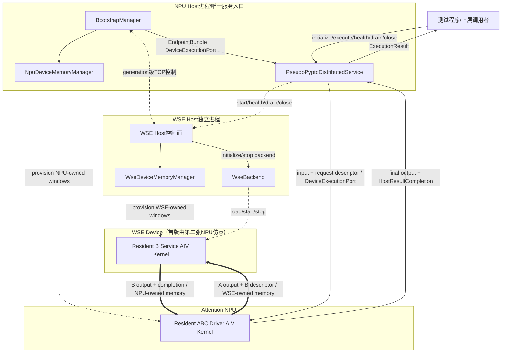
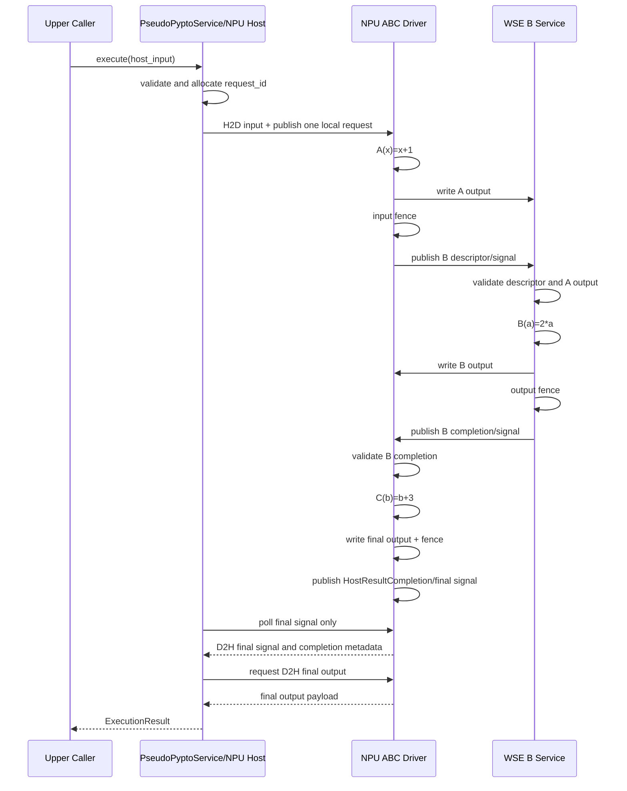

# PyPTO 代理层 A-B-C 分布式服务验证计划

## 1. 目的

本文定义一个不依赖 PyPTO Compiler 和 Scheduler 的代理层原型，用来验证未来 PyPTO
分布式服务的接口假设、资源边界和单次任务执行流程。

原型使用第二张 NPU 仿真 WSE 侧 Device。在非 PyPTO 的外部资源层完成双进程启动、
Device Memory 分配、VMM handle 交换和 peer attach 后，将已经就绪的通信资源以
`EndpointBundle` 形式借给代理层。上层只访问 NPU Host 上的代理服务入口。

一次同步请求执行以下串行数据流：

```text
Host input
  → NPU Device
  → A(NPU)
  → NPU-to-WSE Device Memory
  → B(WSE)
  → WSE-to-NPU Device Memory
  → C(NPU)
  → Host result
```

本验证需要回答：

1. 外部资源层能否初始化出代理层可直接消费的跨 Device 通信能力。
2. 上层能否把代理层作为单入口、同步调用的 PyPTO 分布式服务使用。
3. Host 每个请求只参与输入、一次服务提交和最终结果，不参与 A→B→C 中间推进。
4. 代理层能否提交并完成预定义的 A→B→C 跨设备程序，并提供足够的状态或执行证据
   证明串行关系和最终结果正确。
5. 当前已验证的 NPU P2P 能力与未来真实 WSE backend 能否通过接口隔离。

## 2. 已确认决策

| 项目 | 首版决策 |
| --- | --- |
| WSE 形态 | 第二张 NPU 仿真 WSE Device，预留真实 WSE backend |
| 设备执行 | Attention driver 和 WSE service 使用常驻 AIV kernel |
| PyPTO 依赖 | 不使用 PyPTO Compiler/Scheduler，提供伪 PyPTO 服务接口 |
| 资源所有权 | 外部 `BootstrapManager` 所有，代理层只借用 |
| 请求接口 | 同步、单请求、`max_inflight=1` |
| 数据类型 | `uint32` 确定性计算 |
| Host 边界 | 不参与 A→B→C 中间推进 |
| 部署 | 同 Host、两个独立进程、两张 NPU |
| 故障范围 | 首版只验证正常路径 |
| 交付顺序 | 先确认本文档，再实现原型 |

## 3. 能力声明边界

本原型通过后可以声明：

- 同 Host 双 NPU 环境中，外部通信资源可以注入伪 PyPTO 服务。
- 上层可以通过 NPU Host 的单一同步接口调用分布式 A→B→C 程序。
- A、B、C 的中间数据和执行推进不经过 Host。
- 代理层能够提供足够的状态或执行证据，证明预定义 ABC 程序的执行顺序和结果正确。
- 通信、资源管理、代理服务和设备 backend 的软件边界可实现。

本原型通过后仍不能声明：

- 真实 NPU↔WSE 数据通信可用。
- WSE Runtime、WSE Model 或 FFN 可用。
- PyPTO Compiler、Scheduler、Remote Task 或 DAG 已验证。
- Attention 侧不占用 AIC/AIV；首版 driver 会占用一个 AIV。
- AICPU Scheduler 可以直接操作 Endpoint。
- RoCE/UB 跨 Host 数据面可用。
- 多请求并发、故障恢复或生产级性能满足要求。

本原型的建议能力标签为：

```text
PSEUDO_PYPTO_SERVICE
HOST_LOCAL_SECOND_NPU_WSE
AIV_DEVICE_DRIVEN_ABC
SINGLE_REQUEST_SYNCHRONOUS
```

禁止直接沿用不带限定词的“PyPTO C2”或“NPU-WSE可用”作为结论。

## 4. 总体架构



架构图中的关系：

- 虚线是初始化、READY 和关闭使用的 Host 控制面。
- 粗实线是请求执行期间的跨 Device Memory 数据面。
- 普通实线是本地模块调用、服务入口和最终结果返回。
- 数据结构、上下文和内存资源只出现在连线标签中，不作为模块节点。

`execute()` 可以在 NPU Host 参与服务入口和最终返回，但不得调用 WSE Host 推进 B，
也不得把 A/B 中间结果复制回 Host。

### 4.1 模块总览

上层调用者是架构外部参与者，不计入内部模块。内部模块只列有独立行为和职责的组件：

| 模块 | 运行位置 | 主要动作 | 是否参与逐请求路径 |
| --- | --- | --- | --- |
| `BootstrapManager` | NPU Host入口进程 | 编排两端初始化、handle交换、建链和资源生命周期 | 否 |
| `NpuDeviceMemoryManager` | NPU Host入口进程 | 创建和释放NPU侧Device Context、owned window和peer mapping | 否 |
| `WSE Host控制面` | WSE Host进程 | 执行远端Bootstrap及backend生命周期命令 | 否 |
| `WseDeviceMemoryManager` | WSE Host进程 | 创建和释放WSE侧owned window和peer mapping | 否 |
| `PseudoPyptoDistributedService` | NPU Host入口进程 | 接收请求、提交整体invocation并返回最终结果 | 是，仅入口和最终返回 |
| `WseBackend` | WSE Host进程 | 加载、启动、健康检查和停止B Service | 否 |
| `Resident ABC Driver` | Attention NPU | 执行A、设备侧提交并等待B、执行C和发布最终完成 | 是 |
| `Resident B Service` | WSE Device（第二张NPU仿真） | 消费B请求、执行B并写回结果和completion | 是 |

以下是模块使用的数据、资源或能力接口，不作为运行模块：

| 对象 | 类别 | 用途 |
| --- | --- | --- |
| `EndpointBundle` | 资源描述对象 | 聚合已建链的Endpoint、借用视图、layout和generation |
| `DeviceExecutionPort` | 借用能力接口 | 提供Kernel、H2D/D2H和最终completion操作，没有独立执行循环 |
| `BootstrapLease` | 生命周期令牌 | 约束资源借用有效期，防止释放后继续访问 |
| `PseudoProgramSpec` | 配置数据 | 描述首版固定ABC程序及可选依赖元数据 |
| `BorrowedWindowView` | 内存视图 | 引用Bootstrap子系统拥有的Device Memory，不拥有释放能力 |
| request/descriptor/completion | 协议数据结构 | 传递请求、B任务、完成状态和校验信息 |
| Device Memory windows | 通信资源 | 保存输入、中间结果、控制信息、报告和最终结果 |

图中的结果返回路径为：

```text
Resident B Service → Resident ABC Driver
  → PseudoPyptoDistributedService._wait_for_final_completion()
  → PseudoPyptoDistributedService → 上层调用者
```

结果不经过WSE Host、TCP控制面或`BootstrapManager`；详细步骤由第11章描述，
可见性规则由第12.3节定义。

## 5. 软件分层与职责

### 5.1 上层调用者

只依赖伪 PyPTO 服务接口：

```python
service.initialize(endpoint_bundle, program_spec)
result = service.execute(host_input, timeout_s=...)
status = service.health()
service.drain(timeout_s=...)
service.close()
```

上层调用者不感知：

- NPU/WSE Device ID；
- VMM handle、peer address 和 P2P 配置；
- B submission/completion queue；
- A/B/C kernel 名称；
- slot、fence 和 sequence 信号。

### 5.2 BootstrapManager

`BootstrapManager` 位于代理层以上，使用非 PyPTO 能力完成：

- 通过`launch_wse_host()`拉起WSE Host并完成非通信初始化；
- 通过`launch_npu_host()`完成NPU Host及本地Device Context的非通信初始化；
- 通过`build_communication()`指挥两侧MemoryManager分配通信内存并完成建链；
- VMM handle 导出和 TCP 交换；
- peer handle 导入和 P2P attach；
- Transport、layout 和 generation 校验；
- 创建只含执行能力的 `DeviceExecutionPort`；
- 创建 NPU 进程内可借用的 `EndpointBundle`；
- 代理关闭后的 detach、unregister、free 和 Device Context close。

`BootstrapManager` 是两端通信内存的逻辑所有者和生命周期协调者，但不能跨进程直接调用
WSE Device Context。NPU侧分配/释放由本地`NpuDeviceMemoryManager`实际执行，WSE侧
分配/释放由WSE Host内的`WseDeviceMemoryManager`实际执行。二者都属于Bootstrap子系统，
不属于代理服务或`WseBackend`。底层ACL/VMM API只是实现内存操作的原语，不承担资源所有权
和生命周期策略。

`BootstrapManager` 不负责：

- A/B/C 任务定义；
- invocation 状态推进；
- 每次请求的 WSE B dispatch；
- 中间 Tensor 搬运；
- 最终结果计算。

### 5.3 PseudoPyptoDistributedService

代理层负责：

- 校验 `EndpointBundle` 和 `PseudoProgramSpec`；
- 启动 NPU resident driver 和 WSE resident service；
- 接收同步 Host 输入；
- 生成 request ID 和 invocation descriptor；
- 将输入复制到 NPU Device Memory；
- 向 NPU driver 提交一次整体 invocation；
- 等待最终 C completion；
- 把最终结果复制回 Host；
- 提供 health、drain 和 close；
- 暴露结构化执行证据和错误。

代理层不负责：

- 创建、注册、导出或导入通信窗口；
- 解析 CANN VMM shareable handle；
- 获取 `NpuDeviceMemoryManager` 或 `WseDeviceMemoryManager`；
- 逐阶段在 Host 启动 A、B、C；
- Host 中转 A/B 中间数据；

首版不要求代理层实现通用 DAG Scheduler、拓扑排序、动态 placement 或 ready queue，
但也不禁止代理层为了实现和验证方便而解析固定 ABC 依赖、维护阶段状态或使用轻量状态机。
这些机制属于原型内部实现，不作为 PyPTO Compiler/Scheduler 能力通过的证据。无论采用
哪种内部实现，Host 都不能根据 A/B 的完成事件逐阶段发起后续计算或中转中间数据。

### 5.4 WseBackend

首版 backend 负责：

- 在第二张 NPU 上加载 B service binary；
- 绑定并使用 Bootstrap 子系统提供的本地和 peer Device Memory view；
- 启动一次 B service AIV kernel；
- 报告 READY、health 和最终 stop；
- 提供 kernel hash 和设备执行报告。

`WseBackend`不创建、导入、映射或释放通信内存，也不持有两个MemoryManager。

未来真实 WSE backend 必须保持代理层接口不变，只替换：

- Bootstrap 提供的 WSE Endpoint view 的绑定方式；
- B service artifact加载；
- submission/doorbell消费；
- B计算；
- NPU output window写回与completion发布。

## 6. 资源所有权

### 6.1 所有权规则

```text
BootstrapManager subsystem logically owns:
  WSE Host process/control session
  BootstrapLease
  NpuDeviceMemoryManager
    NPU Device Context
    NPU owned window
    NPU imported peer mapping
  WSE Host control plane
    WseDeviceMemoryManager
      WSE Device Context
      WSE owned window
      WSE imported NPU mapping

PseudoPyptoDistributedService borrows:
  DeviceExecutionPort
  local window views
  peer window views
  Device Endpoint descriptors
  generation and layout
  WSE generation-level control handle
```

逻辑所有权统一归于 `BootstrapManager`，物理操作由 Device Context 所在进程的本地
MemoryManager 执行。代理层和`WseBackend`均不得直接调用
`allocate_window()`、`import_window()`、`map_window()` 或 `free_window()`。可以在单元
测试中将这些 API 替换成“调用即失败”的桩，确认服务执行期间没有越过边界。

### 6.2 生命周期顺序

```text
BootstrapManager.launch_wse_host()
  → launch WSE Host and initialize WSE Device runtime/context
BootstrapManager.launch_npu_host()
  → initialize NPU Host and NPU Device runtime/context
BootstrapManager.build_communication()
  → NpuDeviceMemoryManager allocate/register/export
  → command WseDeviceMemoryManager allocate/register/export
  → exchange/import/attach on both local managers
  → create DeviceExecutionPort and BootstrapLease
  → EndpointBundle CREATED

service.initialize(bundle)
  → start WSE B service
  → start NPU ABC driver
  → SERVICE_READY

service.execute(input)
  → one synchronous invocation

service.health()
  → READY

service.drain()
  → stop admission and wait current request

service.close()
  → stop resident kernels and release borrowed views

BootstrapManager.release()
  → command both local managers to release peer imports
  → command both local managers to unregister/free owned windows
  → close Device Contexts/processes
```

硬性顺序约束：

```text
service.close completed
  before BootstrapManager.release starts
```

如果 `BootstrapManager.release()` 检测到代理尚未 close，应拒绝释放，而不是提前解除
仍可能被设备访问的映射。

## 7. EndpointBundle设计

`EndpointBundle` 是 NPU Host 进程内对象，不通过网络序列化，也不拥有资源：

```python
@dataclass(frozen=True)
class EndpointBundle:
    generation: int
    endpoint_id: str
    backend_kind: str
    transport_kind: str
    transport_scope: str
    layout: ProxyBufferLayout
    execution_port: BorrowedDeviceExecutionPort
    npu_local_window: BorrowedWindowView
    wse_peer_window: BorrowedWindowView
    npu_device_descriptor: ProxyDeviceEndpointDesc
    wse_control: WseServiceControl
    lease_id: str
```

要求：

- `generation`、layout hash 和 backend capability 必须在构造时校验。
- `EndpointBundle` 不公开 VMM raw shareable handle。
- `EndpointBundle` 不包含 allocator、MemoryManager、import/export、map/unmap 或 free 接口。
- `BorrowedDeviceExecutionPort` 只允许 Kernel launch、H2D/D2H 和最终 completion 操作。
- `BorrowedWindowView` 不能执行 free/unregister。
- `lease_id` 用于防止代理使用已经释放的资源。
- `BootstrapManager` release 后，所有 bundle 调用必须 fail closed。
- 代理初始化后不得更换 bundle 或 generation。

### 7.1 Device Endpoint descriptor

代理层需要的设备侧描述符建议为固定布局：

```c
struct ProxyDeviceEndpointDesc {
    uint32_t protocol_version;
    uint32_t backend_kind;
    uint64_t generation;

    uint64_t npu_input_addr;
    uint64_t npu_b_output_addr;
    uint64_t npu_final_output_addr;
    uint64_t npu_local_control_addr;

    uint64_t remote_b_input_addr;
    uint64_t remote_b_submission_addr;

    uint64_t local_b_completion_addr;
    uint32_t max_elements;
    uint32_t max_inflight;
};
```

这是进程内、设备可消费的descriptor，不应出现在脱敏evidence中。跨进程只交换
owner、buffer ID、generation、size和opaque handle。

## 8. 内存布局

首版`max_inflight=1`，不实现多slot并发。

### 8.1 NPU owned window

由 `NpuDeviceMemoryManager` 分配和释放：

```text
NpuWindow
  input_x[MAX_ELEMENTS]             uint32
  b_output[MAX_ELEMENTS]            uint32
  final_output[MAX_ELEMENTS]        uint32
  host_request                      HostRequestDescriptor
  host_result                       HostResultCompletion
  b_completion                      RemoteTaskCompletion
  driver_report                     ProxyDriverReport
  lifecycle                         ProxyLifecycleControl
```

WSE Device需要写入：

- `b_output`
- `b_completion`

### 8.2 WSE owned window

由WSE Host进程内的`WseDeviceMemoryManager`分配和释放：

```text
WseWindow
  b_input[MAX_ELEMENTS]             uint32
  b_submission                      RemoteTaskDescriptor
  service_report                    ProxyServiceReport
  lifecycle                         ProxyLifecycleControl
```

NPU需要写入：

- `b_input`
- `b_submission`

### 8.3 对齐

- payload起始地址按当前VMM和kernel要求对齐。
- descriptor、completion、signal、report分别占用独立64 B cache line。
- signal与payload不能共享cache line。
- 所有offset和总大小进入layout hash。
- 数据长度必须是`sizeof(uint32_t)`的整数倍。

## 9. 伪PyPTO程序和任务语义

### 9.1 ProgramSpec

上层只声明一个固定A-B-C程序：

```python
PseudoProgramSpec(
    program_id="abc-v1",
    dtype="uint32",
    max_elements=...,
    tasks=(
        PseudoTask("A", placement="NPU", dependencies=()),
        PseudoTask("B", placement="WSE", dependencies=("A",)),
        PseudoTask("C", placement="NPU", dependencies=("B",)),
    ),
)
```

初始化时只接受严格的 `A(NPU) → B(WSE) → C(NPU)` 契约，其他图直接拒绝。
`tasks` 和 `dependencies` 可以仅作为初始化校验、日志和验证报告的元数据，也可以供
代理层的轻量状态机使用。首版不要求实现通用图构建、拓扑排序、动态 placement 或
ready queue；即使原型内部实现了固定 ABC 的依赖处理，也不能据此声明 PyPTO
Compiler/Scheduler 已得到验证。

### 9.2 计算定义

使用模`2^32`的确定性整数计算：

```text
A(x) = x + 1
B(a) = 2 * a
C(b) = b + 3

expected(x) = 2 * x + 5  (mod 2^32)
```

使用模运算可以避免C++无符号溢出语义不明确。输入由固定seed、generation、request ID
和元素索引生成，每次请求都不同。

### 9.3 Invocation和设备协议状态

```text
FREE
  → HOST_INPUT_READY
  → A_RUNNING
  → A_COMPLETED
  → B_SUBMITTED
  → B_RUNNING
  → B_COMPLETED
  → C_RUNNING
  → C_COMPLETED
  → HOST_RESULT_READY
  → FREE
```

这些状态首先是固定 ABC 设备协议的阶段标记和执行证据，不要求代理层将其实现成通用
任务状态机。代理层可以记录、聚合或校验这些状态。实际执行推进必须由 NPU driver 和
WSE service 在 Device 侧完成；Host 只允许发布 `HOST_INPUT_READY` 并等待
`HOST_RESULT_READY`，不能依据中间阶段逐次启动后续计算。

### 9.4 Descriptor和completion

```c
struct HostRequestDescriptor {
    uint64_t generation;
    uint64_t request_id;
    uint32_t element_count;
    uint32_t dtype;
    uint64_t input_checksum;
    uint64_t sequence;
};

struct RemoteTaskDescriptor {
    uint64_t generation;
    uint64_t request_id;
    uint32_t element_count;
    uint32_t task_kind;       // B
    uint64_t a_output_checksum;
    uint64_t sequence;
};

struct RemoteTaskCompletion {
    uint64_t generation;
    uint64_t request_id;
    uint32_t element_count;
    int32_t status;
    uint64_t b_output_checksum;
    uint64_t sequence;
};

struct HostResultCompletion {
    uint64_t generation;
    uint64_t request_id;
    uint32_t element_count;
    int32_t status;
    uint64_t final_checksum;
    uint64_t sequence;
};
```

## 10. 服务接口

### 10.1 initialize

```python
def initialize(
    self,
    endpoint_bundle: EndpointBundle,
    program_spec: PseudoProgramSpec,
) -> ServiceReady:
    ...
```

`initialize()`按以下五个内部函数依次执行：

1. `_validate_initialization_context()`：校验状态、program、lease、layout和backend capability。
2. `_initialize_control_regions()`：初始化resident kernel使用的控制区。
3. `_start_wse_execution_service()`：通过WSE control启动resident B service。
4. `_start_npu_execution_driver()`：绑定两侧地址并启动resident NPU ABC driver。
5. `_wait_until_ready()`：等待两端Device任务READY并将服务置为`READY`。

初始化失败必须保持fail closed，不允许进入`READY`。

### 10.2 execute

```python
def execute(self, host_input: Buffer, timeout_s: float) -> ExecutionResult:
    ...
```

首版同步且只允许一个在途请求：

1. 服务状态必须为`READY`。
2. 分配单调递增`request_id`。
3. 校验dtype、大小和对齐。
4. H2D复制到NPU `input_x`。
5. 写入`HostRequestDescriptor`。
6. 执行Host→Device可见性操作并发布本地request signal。
7. 由Service私有方法`_wait_for_final_completion()`轮询最终signal并读取
   `HostResultCompletion`，不等待中间B completion。
8. 校验generation、request ID、status、长度和checksum。
9. D2H复制`final_output`。
10. 返回`ExecutionResult`，服务恢复`READY`。

若状态为`EXECUTING`，第二个请求返回`BUSY`。首版不排队。

### 10.3 health

返回：

- service状态；
- generation和lease有效性；
- NPU driver ready/运行状态；
- WSE service ready/运行状态；
- 当前request ID；
- 最近一次执行结果。

首版正常路径测试只要求初始化后、执行后和drain前健康状态为`READY/HEALTHY`。

### 10.4 drain

- 状态从`READY`变为`DRAINING`。
- 停止接收新请求。
- 等待当前同步请求完成；正常测试中调用时应没有在途请求。
- 通知两个resident kernel停止admission并退出。
- 确认NPU driver和WSE service均停止访问window。
- 返回`DRAINED`。

### 10.5 close

- 要求已经drain，或内部先执行drain。
- 关闭kernel binary、stream和代理持有的borrowed view。
- 不释放owned window和peer import。
- 标记bundle不再被代理使用。
- 重复close应幂等。
- 完成后允许`BootstrapManager.release()`。

## 11. 单次执行详细时序



请求执行期间不得出现：

- NPU Host向WSE Host发送`RUN_B`；
- Host读取A output后再发送给WSE；
- Host读取B output后再启动C；
- 每阶段一次kernel launch；
- completion之后通过固定sleep等待数据可见。

## 12. Resident AIV kernel设计

### 12.1 NPU ABC driver

初始化后常驻等待本地Host request signal：

```text
wait HOST_INPUT_READY
  → validate request
  → compute A into remote b_input
  → input fence
  → publish B submission
  → wait B completion
  → validate completion and b_output
  → compute C into local final_output
  → final fence
  → publish HOST_RESULT_READY
  → wait next request or STOP
```

首版允许AIV轮询本地request和B completion。这是快速代理验证的明确降级，不作为最终
PyPTO Scheduler实现。设备报告必须记录poll cycles，便于评估后续迁移到AICPU event或
异步通信引擎的必要性。

### 12.2 WSE B service

初始化后常驻：

```text
wait B submission
  → validate generation/request/element_count
  → validate A output
  → compute B into remote b_output
  → output fence
  → publish B completion
  → wait next request or STOP
```

首版只有一个slot和一个在途请求，不实现乱序completion。

### 12.3 可见性顺序

必须沿用已验证的顺序：

```text
payload store
  → DSB_ALL or backend-defined visibility fence
  → metadata store
  → DSB_ALL or backend-defined visibility fence
  → signal store
```

四个发布边界分别为：

1. Host input/descriptor → NPU request signal。
2. A output/B descriptor → WSE submission signal。
3. B output/completion metadata → NPU completion signal。
4. C output/final metadata → Host result signal/event。

Host result 路径不能通过 synchronize 常驻 Kernel 所在 stream 来等待完成。首版由独立
completion observer 读取最终 signal；读取到匹配 signal 后，必须通过
`DeviceExecutionPort` 按底层设备 API 定义的可见性操作读取 completion metadata 和
final output，不能用固定 sleep 代替 fence。

## 13. Host热路径边界

此前纯通信C2要求Host热路径消息为零。本例的入口本身位于NPU Host，因此每个请求允许：

```text
host_service_requests             = 1
host_input_h2d_bytes              = input_bytes
host_final_completions            = 1
host_final_signal_poll_reads      >= 1
host_final_control_d2h_bytes       = signal_poll_bytes + completion_metadata_bytes
host_final_payload_d2h_bytes       = output_bytes
```

每个请求必须满足：

```text
host_wse_invocation_rpcs          = 0
host_intermediate_payload_bytes   = 0
host_a_to_b_c_stage_transitions   = 0
host_b_completion_polls           = 0
host_mid_graph_kernel_launches    = 0
```

`execute()`阻塞等待最终服务结果是允许的；Host轮询或接收B completion并推进C是不允许的。
首版允许 Host 轮询 Attention NPU 上的最终 signal，但必须独立统计轮询次数和控制 D2H
字节数，且轮询对象不能包含 B completion 或 A/B 中间 payload。

## 14. 验证用例

### V00：契约与边界单元测试

验证：

- ProgramSpec 只接受固定 A→B→C 契约；依赖元数据可以由代理校验或直接使用固定常量；
- generation、lease、layout mismatch失败；
- `EndpointBundle` 和 `DeviceExecutionPort` 不暴露 MemoryManager 或
  allocate/import/map/free；
- service和`WseBackend`不能调用通信内存管理API；
- 非READY状态不能execute；
- 单请求执行期间第二次execute返回BUSY；
- close后不能execute；
- duplicate close幂等。

该用例不需要NPU。

### V01：双进程初始化与READY

分别执行Attention-first和WSE-first：

1. BootstrapManager启动两端。
2. 两端本地MemoryManager分别分配窗口，由BootstrapManager协调交换VMM handle。
3. attach后产生EndpointBundle。
4. service.initialize启动两个resident kernel。
5. health返回READY。

通过条件：

- 两个进程绑定不同NPU；
- bundle和两侧manifest generation/layout一致；
- 两端各只启动一次resident kernel；
- 初始化阶段没有Tensor业务数据；
- 所有allocate/import/map调用均可追溯到Bootstrap子系统的两个本地MemoryManager；
- service和`WseBackend`未越权分配通信资源。

### V02：单次4 KiB A-B-C

执行一个4 KiB `uint32`输入。

通过条件：

- 每个元素满足`result == 2*input+5 mod 2^32`；
- A、B、C各执行一次；
- Device 协议阶段或等价执行证据能够证明执行顺序为 A→B→C；
- 不要求代理层必须建立通用任务状态或依赖调度模型；
- Host只看到service request和final result；
- A/B中间数据没有D2H/H2D；
- 最终结果经Attention NPU本地completion和D2H返回，不经过WSE Host或TCP；
- completion observer不等待常驻Kernel stream结束，也不读取B completion；
- 两个resident kernel没有重复launch。

### V03：消息大小矩阵

顺序执行：

- 64 B；
- 4 KiB；
- 64 KiB；
- 1 MiB。

通过条件：

- 所有输入输出完整；
- checksum、request ID、generation和element count全部一致；
- 每次执行后service恢复READY；
- 没有重新分配或重新attach通信window。

### V04：连续同步请求

- 同一个service generation连续执行100次。
- 每次使用不同request ID、seed和输入大小。
- 保持`max_inflight=1`。

通过条件：

- 100/100结果正确；
- request ID严格递增；
- 没有读到旧A/B/C数据；
- resident kernel launch count仍为1/1；
- window/peer mapping没有增长；
- Host中间路径计数仍为零。

### V05：正常health/drain/close/release

1. 初始化并执行至少一个请求。
2. `health()`返回HEALTHY。
3. `drain()`停止admission并使两个kernel退出。
4. `close()`释放代理资源引用。
5. `BootstrapManager.release()`按顺序解除映射和释放资源。

通过条件：

- drain后不能execute；
- 两端kernel停止后才释放window；
- proxy close发生在bootstrap release之前；
- 两端MemoryManager释放peer import和owned window后，stream、binary和Device Context全部关闭；
- 重复close成功；
- P2P HBM和底层Device资源回到基线。

### V06：新generation正常重建

首版不注入错误，只验证正常重建：

1. generation G执行、drain、close和release。
2. BootstrapManager创建generation G+1。
3. 新service执行一个请求。

通过条件：

- G+1使用新lease和新窗口；
- G+1结果正确；
- G资源已经释放；
- service对象不能复用G的EndpointBundle。

## 15. 测试矩阵

| Case | 启动顺序 | payload | 请求数 | 设备计算 | 预期 |
| --- | --- | ---: | ---: | --- | --- |
| V01 | Attention-first | 0 | 0 | 无 | READY |
| V01 | WSE-first | 0 | 0 | 无 | READY |
| V02 | 两种顺序至少一种 | 4 KiB | 1 | A/B/C | PASS |
| V03 | Attention-first | 64 B～1 MiB | 4 | A/B/C | PASS |
| V03 | WSE-first | 64 B～1 MiB | 4 | A/B/C | PASS |
| V04 | 两种顺序至少一种 | 混合 | 100 | A/B/C | PASS |
| V05 | 两种顺序至少一种 | 4 KiB | 1 | A/B/C | CLEAN |
| V06 | 两种顺序至少一种 | 4 KiB | 1+1 | 两代A/B/C | PASS |

首版只验证正常路径，不包含：

- B timeout；
- 错误generation；
- 错误completion；
- 进程SIGKILL；
- 执行中drain/close；
- 并发请求和queue full。

这些用例由既有通信验证覆盖了第二张NPU仿真协议基础，但新的代理服务仍需重新验证。

## 16. 观测和证据

### 16.1 Host侧

- `initialize/execute/health/drain/close`调用次数和状态。
- 每个 request 的输入 H2D、最终 signal 轮询次数、最终控制 D2H 和最终 payload D2H
  字节数。
- WSE invocation RPC次数，必须为0。
- Host intermediate payload字节数，必须为0。
- Host mid-graph kernel launch数，必须为0。
- resident driver/service kernel launch数，必须各为1。
- 初始化、execute、drain和close耗时。

### 16.2 Device侧

NPU driver report：

- accepted/completed request数；
- A/C执行次数；
- B submission/completion数；
- input/A/B/final checksum错误；
- generation/request/sequence错误；
- 每阶段状态转换计数；
- 等待Host request和B completion的cycles；
- 最终执行cycles。

WSE service report：

- B accepted/completed数；
- A output校验数；
- B output checksum；
- generation/request/sequence错误；
- input/output fence数；
- 等待submission和B计算cycles。

### 16.3 Resource侧

- 实际backend和transport scope。
- shareable handle只保存SHA-256，不保存raw值。
- peer enable、import、map、unmap和release结果。
- 每次内存管理操作的调用方身份；只能是两个Bootstrap本地MemoryManager之一。
- 执行前后窗口和mapping数量。
- P2P HBM释放日志或计数。
- `BootstrapLease`状态转换。

### 16.4 Artifact

```text
artifacts/<run_id>/
  environment.json
  bootstrap.json
  endpoint_bundle.json          # 脱敏摘要
  program_spec.json
  npu_proxy.json
  wse.json
  result.json
  device_logs/
```

`endpoint_bundle.json`不能包含Device VA或raw VMM handle。

## 17. 通过标准

本原型总体通过必须同时满足：

1. V00～V06全部通过。
2. 两种进程启动顺序均至少完成一次完整V03。
3. 上层只调用代理服务API，不直接访问Transport或WSE进程。
4. Bootstrap子系统独占通信资源的逻辑所有权；两端物理操作仅由各自本地
   MemoryManager执行。
5. 代理服务、`WseBackend`、`EndpointBundle`和`DeviceExecutionPort`均不能调用
   allocate/import/map/free。
6. 每个请求只发生输入 H2D、最终 signal/completion 控制 D2H 和最终 payload D2H，且三类
   字节分别统计。
7. Host不参与A→B→C中间状态转换。
8. 执行证据证明A、B、C执行次数和顺序正确，不限定代理层内部如何描述或管理固定依赖。
9. 所有消息大小和100次重复请求结果正确。
10. 两个resident kernel每个generation各只launch一次。
11. 正常drain/close/release顺序正确且无残留资源。
12. 结论明确标记为第二张NPU仿真WSE、HOST_LOCAL和AIV driver。

## 18. 当前已有能力和可复用内容

当前分支已经提供：

- 两进程TCP bootstrap和启动顺序控制；
- ACL Device Context和VMM window分配；
- VMM handle跨进程交换、import和P2P mapping；
- NPU→WSE和WSE→NPU双向Device Memory访问；
- `AclDeviceKernel`加载、launch、synchronize和close；
- AIV resident driver/service的remote load/store与`DSB_ALL`模式；
- generation、slot、checksum和设备报告基础；
- 脱敏evidence collector和fail-closed contract测试；
- normal drain/close的资源释放顺序参考。

建议复用但不直接耦合到既有case：

- `AclVmmRuntime`，仅复用其底层ACL/VMM原语，不把它作为通信内存所有者；
- `ControlChannel`和stage1协议封装；
- `AclDeviceKernel`；
- stage1B T04/T07的数据发布与可见性模式；
- stage1C T12的正常关闭顺序；
- evidence collector的脱敏规则。

## 19. 当前欠缺能力

### 19.1 代理服务层

- 对上层稳定的伪PyPTO服务对象。
- `initialize/execute/health/drain/close`状态机。
- Host输入和最终结果的同步request API。
- 不依赖常驻Kernel stream结束、且只读取最终signal/completion的
  `_wait_for_final_completion()`。
- 单请求BUSY和request ID管理。
- `ExecutionResult`和结构化错误。

### 19.2 资源注入边界

- 独立`BootstrapManager`和`BootstrapLease`。
- 归属Bootstrap子系统的`NpuDeviceMemoryManager`和`WseDeviceMemoryManager`。
- BootstrapManager到远端MemoryManager的分配、映射和释放控制协议。
- 只读/借用语义的`EndpointBundle`。
- 不含内存管理能力的`DeviceExecutionPort`。
- 防止代理或`WseBackend`释放、映射或重新分配通信资源的API约束。
- release前检查代理已经quiesced/closed。

### 19.3 任务和设备执行

- 固定A-B-C `PseudoProgramSpec`；依赖解析和内部状态管理为可选实现。
- NPU resident ABC driver kernel。
- WSE resident B service kernel（首版在第二张NPU上运行）。
- Host本地request ingress和final result completion。
- A→B和B→C的descriptor、checksum、fence及可证明执行顺序的阶段证据。
- 多次同步请求下的resident kernel循环和STOP协议。

### 19.4 Backend可替换性

- `WseExecutionBackend`抽象。
- `WseBackend`实现。
- 真实WSE backend所需capability contract和未实现占位。
- backend不能持有MemoryManager或向代理暴露VMM/ACL私有细节的边界测试。

### 19.5 证据强度

- 真实测量window/mapping数量，而不是在collector中固定填0。
- 实际backend identity/fallback查询。
- 输入 H2D、最终控制 D2H、最终 payload D2H 和 Host intermediate byte 独立计数。
- A/B/C状态和等待cycles的device report。
- 可重放的运行命令和artifact校验。

## 20. 需要实现的内容

新增以下隔离原型目录，不进入正式`vllm_ascend`运行路径；仅复用
`tools/pypto_wse_validation`已有的底层ACL VMM、控制通道和AIV binary helper：

```text
pypto_test/
  contracts.py
  bootstrap.py
  backend.py
  service.py
  run_proxy_service.py
  README.md
  .gitignore
  kernels/
    abc_driver.cpp
    b_service.cpp
  build_kernels.sh
  tests/
    test_contracts.py
    test_bootstrap.py
    test_backend.py
    test_service.py
    test_evidence.py
  validation/
    validation_utils.py
    collect_evidence.py
  build/       # gitignored
  artifacts/   # gitignored

pypto_docs/
  pypto-wse-proxy-abc-validation-record.md
  pypto-wse-proxy-abc-evidence.json
```

各模块职责：

| 模块 | 实现内容 |
| --- | --- |
| `contracts.py` | ProgramSpec、EndpointBundle、DeviceExecutionPort、descriptor、completion、状态和report |
| `bootstrap.py` | BootstrapManager、两端本地MemoryManager、远端控制协议、manifest、attach、lease和release |
| `backend.py` | WSE backend接口及第二张NPU仿真实现 |
| `service.py` | 五个服务API、同步execute、状态机和最终completion等待 |
| `run_proxy_service.py` | 实机运行入口和两种启动顺序 |
| `abc_driver.cpp` | NPU A、remote B dispatch、等待B、C和final completion |
| `b_service.cpp` | WSE侧B service和remote completion |
| `validation/` | 输入与结果oracle、V01～V06矩阵、证据校验和产物生成 |

## 21. 推荐实现顺序

### M0：冻结契约和无硬件UT

- 实现固定ABC ProgramSpec、EndpointBundle和service状态机；是否解析依赖元数据由实现便利性
  决定。
- 使用fake bundle和fake execution port验证所有权及API边界，确保代理和backend拿不到
  MemoryManager。
- 完成V00。

出口：上层API和资源职责不再变化。

### M1：提取BootstrapManager

- 从现有stage1代码提取`NpuDeviceMemoryManager`和`WseDeviceMemoryManager`，把VMM
  分配、handle交换、attach和释放全部收口到Bootstrap子系统。
- 返回不含内存管理接口的borrowed bundle、`DeviceExecutionPort`和独立lease。
- 保持现有T01～T12不回归。

出口：所有内存管理调用都能追溯到两个本地MemoryManager，代理和backend不能调用任何
通信资源分配或释放API。

### M2：实现resident A/B/C kernel

- 实现NPU ABC driver和WSE侧B service。
- 增加本地Host request/final result信号。
- 复用既有P2P和fence路径。

出口：不经过服务API时，底层单次A-B-C可正确执行。

### M3：接入代理服务API

- initialize启动两个resident kernel。
- execute完成H2D、一次提交、独立observer最终等待和D2H。
- health、drain和close完整。

出口：V01/V02通过。

### M4：矩阵、持续执行和证据

- 完成V03～V06。
- 运行两种启动顺序。
- 生成脱敏证据和验证记录。

出口：满足本文第17节全部通过标准。

基于现有代码复用，预计原型工作量为3～5个工程日，不包含真实WSE、AICPU迁移和
跨Host Transport调试。

## 22. 后续演进

代理原型通过后，建议按以下顺序演进：

1. 保持服务API不变，把固定A-B-C状态机替换为PyPTO Endpoint和Remote Task。
2. 将NPU AIV driver迁移到AICPU Scheduler或设备异步通信引擎。
3. 保持`WseExecutionBackend`不变，使用真实WSE替换当前第二张NPU实现。
4. 重跑错误generation、timeout、进程退出和执行中drain等故障测试。
5. 将HOST_LOCAL VMM P2P替换为跨Host RoCE/UB，并执行C3 gate。
6. 最后用Ray/vLLM Executor替换`BootstrapManager`的进程编排入口。

其中第2和第3项仍是原始WSE Remote FFN架构的关键可行性门槛。代理原型通过只表示
服务抽象和数据流可以成立，不能跳过这两个门槛。
