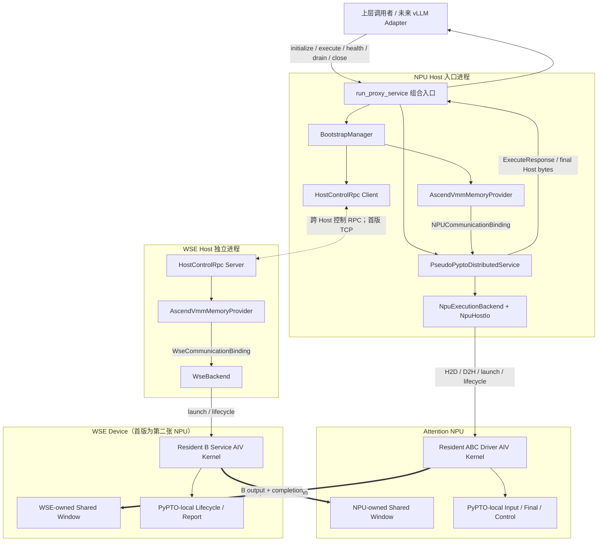

# PyPTO 代理层 A-B-C 分布式服务设计与验证计划

## 1. 目标与范围

本原型使用同一 Host 上的两个独立进程和两张 NPU。第二张 NPU 作为 WSE Device 的功能替身，
验证未来 PyPTO 将 WSE 作为 L0 Worker 时所需的软件边界和 Device 数据路径。

固定任务为 `uint32` 串行计算：

```text
A(NPU): x + 1
B(WSE): 2 * A
C(NPU): B + 3
result: 2 * x + 5 (mod 2^32)
```

本阶段验证：

1. 外部软件建立跨 Device 直接互访内存后，能否只向 PyPTO 注入进程本地 Device 地址。
2. PyPTO 能否自行完成 NPU 输入 H2D、A→B→C Device 执行和最终结果 D2H。
3. 上层能否将其作为 NPU Host 单入口的分布式服务调用。
4. Host RPC 是否只用于初始化和生命周期，不参与 A/B/C 中间推进。
5. 外部资源、PyPTO 服务、NPU backend 和 WSE backend 的边界是否可实现。

本阶段不验证真实 WSE、跨 Host 网络、PyPTO Compiler/Scheduler、并发、故障恢复或性能。

## 2. 总体架构



虚线是 Host 控制面，粗实线是逐请求 Device 数据面。请求执行期间不存在 `EXECUTE`、
`A_COMPLETE` 或 `B_COMPLETE` Host RPC。

## 3. 模块总览

| 模块 | 分层 | 职责 | 逐请求路径 |
| --- | --- | --- | --- |
| `run_proxy_service` | 上层组合入口 | 依次调用 Bootstrap 与服务 API，聚合验证结果 | 仅发起调用和接收最终结果 |
| `BootstrapManager` | 外部基础设施 | 三阶段初始化、资源注入、lease 与释放顺序 | 否 |
| `HostControlRpc` | 外部基础设施接口 | 创建 WSE Host worker，执行 generation 级 RPC | 否 |
| `MultiprocessingSocketRpc` | 外部基础设施实现 | 用 `spawn` 和 TCP 仿真实际跨 Host 控制 RPC | 否 |
| `AscendVmmMemoryProvider` | 外部基础设施实现 | ACL 初始化、Device 选择、VMM、handle、map、peer access 和释放 | 否 |
| `PseudoPyptoDistributedService` | 伪 PyPTO | 稳定服务状态、请求准入、NPU/WSE backend 编排 | 是 |
| `NpuExecutionBackend` | 伪 PyPTO | 本地内存、H2D/D2H、resident A/C driver 和最终 completion | 是 |
| `WseBackend` | 伪 PyPTO | 本地内存、resident B service 和生命周期 | Device 执行参与；Host backend 不逐请求调用 |
| `NpuDeviceCommunication` | 伪 PyPTO ABI | 将注入地址解析为 B output/completion 与远端 submission 地址 | Device kernel 使用 |
| `WseDeviceCommunication` | 伪 PyPTO ABI | 将注入地址解析为 B input/submission 与远端 completion 地址 | Device kernel 使用 |
| 两个 resident AIV kernel | 伪 PyPTO Device backend | 直接远端读写并完成 A→B→C | 是 |

`EndpointBundle`、`NpuCommunicationBinding`、`WseCommunicationBinding`、descriptor、signal、
completion 和 `BootstrapLease` 都是数据结构或能力引用，不作为主动模块。

## 4. 软件边界

### 4.1 外部基础设施负责

- 启动 WSE Host 控制进程。
- `aclInit`、Device 选择和最终 reset/finalize。
- 分配可跨 Device 访问的 VMM physical memory。
- 导出/交换/import shareable handle。
- 两个进程分别 reserve VA、map、设置访问权限和启用 peer access。
- 生成每个进程自己的 local/peer Device VA binding。
- 在 PyPTO `drain/close` 并 quiesce lease 后释放映射和物理内存。

外部基础设施不提供：

- PyPTO 输入 H2D 或结果 D2H。
- PyPTO 本地业务缓冲分配。
- kernel launch。
- A/B/C 任务或逐请求 RPC。

### 4.2 伪 PyPTO 负责

- 对外服务 API、状态和同步单请求准入。
- NPU/WSE Device backend。
- NPU 输入/最终输出及两侧 lifecycle/report 的本地 Device 内存。
- 输入 H2D、最终 completion 轮询和结果 D2H。
- resident kernel 加载、执行、drain 和 unload。
- A→B→C 固定任务的 descriptor/signal/fence/remote load-store ABI。
- 校验 generation、request、sequence、element count 和 checksum。

伪 PyPTO 不导入 `infrastructure`、验证工具或 `AclVmmRuntime`。它只能借用已映射地址，
不能 allocate/import/map/free 跨 Device 内存。

### 4.3 上层能力

上层必须提供：

- Attention/WSE Host 的 placement 与生命周期编排。
- `HostControlRpc` 的实际跨 Host 实现；首版只验证同 Host provider。
- `CrossDeviceMemoryProvider` 的真实 NPU↔WSE 实现。
- 初始化成功、资源身份、generation 和访问范围的 rendezvous。
- PyPTO 关闭后的可靠资源回收。
- 未来 vLLM `DistributedExecutor` 到稳定 PyPTO Service API 的适配。

## 5. 对外服务 API

稳定接口定义在 `pseudo_pypto/api.py`：

```python
initialize(InitializeRequest) -> InitializeResponse
execute(ExecuteRequest) -> ExecuteResponse
health() -> HealthStatus
drain(DrainRequest) -> DrainResponse
close() -> None
```

首版约束为同步、`max_inflight=1`、确定性 `uint32` 和正常路径。`execute` 的输入是 Host bytes，
返回值只包含最终 C 结果及身份/传输度量。

未来 vLLM adapter 的映射为：

| vLLM/Executor 阶段 | PyPTO 服务调用 |
| --- | --- |
| Worker/Executor 初始化 | 外部完成 Bootstrap 后调用 `initialize` |
| `execute_model` | 构造 `ExecuteRequest` 并调用 `execute` |
| 健康检查 | `health` |
| 停止接收新请求 | `drain` |
| Worker/Executor 析构 | `close`，然后外部释放 Bootstrap 资源 |

本原型不导入 vLLM，因此不声称已验证 `DistributedExecutor` 集成。

## 6. 外部资源注入接口

`CrossDeviceMemoryProvider` 只暴露：

```python
initialize_host()
allocate_shared_window() -> WindowManifest
attach_peer(peer_manifest)
binding(peer_manifest) -> CrossDeviceMemoryBinding
release()
evidence()
```

NPU 进程和 WSE 进程获得不同的 VA；manifest 只交换 opaque handle、Device、size、generation
和 layout hash，绝不交换或持久化对端进程 VA。

注入 PyPTO 的 binding 只有：

```text
generation
local_shared_base / local_shared_bytes
peer_shared_base / peer_shared_bytes
```

无 allocator、copy、kernel launch 或 release 方法。

## 7. 内存布局与所有权

### 7.1 PyPTO 本地 NPU window

由 `NpuExecutionBackend` 使用普通 `aclrtMalloc` 分配：

```text
input | final output | Host request signal/descriptor
      | Host result signal/descriptor | lifecycle | report
```

只有这里发生输入 H2D 和最终结果 D2H。

### 7.2 外部 NPU-owned shared window

由 NPU Host 的 `AscendVmmMemoryProvider` 分配，WSE 进程导入：

```text
B output | B completion signal | B completion descriptor
```

### 7.3 外部 WSE-owned shared window

由 WSE Host 的 `AscendVmmMemoryProvider` 分配，NPU 进程导入：

```text
B input | B submission signal | B submission descriptor
```

### 7.4 PyPTO 本地 WSE window

由 `WseBackend` 使用普通 `aclrtMalloc` 分配：

```text
lifecycle | report
```

释放顺序固定为：停止两个 kernel → 释放 PyPTO 本地内存 → quiesce lease → 释放外部 peer
mapping/owned VMM → reset/finalize ACL。

## 8. 初始化流程

```text
1. launch_wse_host
   MultiprocessingSocketRpc.spawn WSE Host
   WSE external provider performs ACL/device initialization
   WSE_HOST_READY

2. launch_npu_host
   NPU external provider performs ACL/device initialization

3. build_communication
   NPU provider allocates/exports NPU shared window
   BUILD_COMMUNICATION(manifest) RPC
   WSE provider allocates/exports WSE shared window and imports NPU window
   RPC returns WSE manifest
   NPU provider imports WSE window
   Bootstrap creates lease and injects NPU binding

4. service.initialize
   validate request and bundle
   construct NPU execution backend
   START WSE generation; WSE backend allocates local memory and launches B
   NPU backend allocates local memory and launches A/C driver
   both Device kernels report READY
```

`BUILD_COMMUNICATION` 的 RPC 返回发生在 WSE attach 成功之后；NPU attach 和 bundle 创建完成后
才允许 `START`，因此两个 resident kernel 不会观察到未完成的 mapping。

## 9. 请求与结果路径

```text
Upper Host bytes
  -> PseudoPyptoDistributedService.execute
  -> NpuExecutionBackend / NpuHostIo H2D
  -> NPU local input + request descriptor/signal
  -> Resident NPU kernel executes A
  -> remote store A output/descriptor/fence/signal to WSE shared window
  -> Resident WSE kernel executes B
  -> remote store B output/descriptor/fence/signal to NPU shared window
  -> Resident NPU kernel executes C
  -> NPU local final output + final descriptor/signal
  -> NpuHostIo polls only final signal and performs final D2H
  -> ExecuteResponse
  -> Upper caller
```

结果不经过 WSE Host、HostControlRpc、BootstrapManager 或外部 VMM provider。Host 不读取 A output、
B input/output、submission 或 B completion 来推进任务。

## 10. Device 通信 ABI

`NpuDeviceCommunication` 和 `WseDeviceCommunication` 固定 kernel 可见地址。发布规则为：

```text
NPU -> WSE: data -> descriptor -> fence -> submission signal
WSE consumes: signal -> fence -> descriptor/data
WSE -> NPU: data -> completion descriptor -> fence -> completion signal
NPU consumes: signal -> fence -> descriptor/data
```

descriptor 包含 generation、request ID、element count、sequence、status 和 checksum。每个 signal
独占 cache line。当前单 slot 依赖单请求和单调 sequence；不能外推为并发协议。

## 11. 代码结构

```text
pypto_test/
  pseudo_pypto/
    api.py                 # 稳定上层接口
    communication.py       # Device ABI、binding、descriptor、layout、lease
    backend.py             # NPU/WSE backend、本地内存、H2D/D2H、kernel runtime
    service.py             # 服务状态与 backend 编排
    kernels/
      abc_driver.cpp
      b_service.cpp
  infrastructure/
    rpc.py                 # HostControlRpc 及 multiprocessing+TCP provider
    memory.py              # CrossDeviceMemoryProvider 及 Ascend VMM provider
    bootstrap.py           # 三阶段初始化与资源注入
  validation/
    validation_utils.py    # 输入生成、CPU oracle、结果打印
    collect_evidence.py    # V01-V06 runner 和 fail-closed 校验
  tests/                   # Host-only API/边界测试
  run_proxy_service.py     # 薄组合入口和 CLI
```

依赖方向为：入口可组合 `infrastructure` 与 `pseudo_pypto`；`infrastructure` 实现 PyPTO 的资源需求；
`pseudo_pypto` 不反向导入基础设施或验证代码。

## 12. 十阶段实施与验收

| 阶段 | 实施内容 | 验收 |
| --- | --- | --- |
| 0 | 冻结 typed service API、binding 和 provider 接口 | API/contract UT |
| 1 | 物理拆分 `pseudo_pypto` 与 `infrastructure` | import tree 检查 |
| 2 | 抽象 `HostControlRpc` | 两种启动顺序 RPC UT |
| 3 | 抽象跨 Device memory provider | handle 脱敏、binding、release UT |
| 4 | 拆分本地内存和共享 VMM | layout 与 kernel 地址 UT |
| 5 | PyPTO 内部直接 H2D/D2H | backend/service UT 与实机输出 |
| 6 | 固定 NPU/WSE Device 通信 ABI | 双向地址对称性 UT |
| 7 | 对称 NPU/WSE execution backend | resident lifecycle/report |
| 8 | 保留三阶段 Bootstrap | 事件顺序与能力注入 UT |
| 9 | 稳定上层 API 和未来 vLLM 映射 | runtime-checkable API 与本文档 |
| 10 | 更新 CLI、矩阵、证据和文档 | V01-V06 全量 PASS |

## 13. 验证矩阵

| Case | 内容 | 通过条件 |
| --- | --- | --- |
| V01 | 两种 Host 启动顺序、零请求生命周期 | 双端 READY、drain、release |
| V02 | 1 个 4 KiB 请求 | A/B/C 各一次，结果正确 |
| V03 | 64 B、4 KiB、64 KiB、1 MiB；两种启动顺序 | 全尺寸双向 Device 路径正确 |
| V04 | 100 个串行混合请求 | resident kernel 仅 launch 一次，无 slot 污染 |
| V05 | 正常关闭 | PyPTO 本地内存和外部 mapping 全部释放 |
| V06 | generation 1/2 | run、lease 和资源不复用 |

Fail-closed 不变量：

- `host_intermediate_bytes == 0`。
- Host RPC 不含 `EXECUTE/A_COMPLETE/B_COMPLETE`。
- A/B/C run count 与 request count 相同，所有 error count 为 0。
- 每端每 generation 只分配一个外部 shared window，两个 mapping 最终均为 0。
- 两端 PyPTO 本地内存最终均已释放。
- 每端 resident kernel 每 generation 只 launch 一次。

## 14. 可声明结论与剩余风险

通过后可以声明：同 Host 双进程、第二张 NPU 作为 WSE backend 时，资源注入、PyPTO 自有
H2D/D2H、Device remote-store 数据路径、固定 A→B→C 依赖和稳定服务入口可行。

仍未验证：

- 真实 WSE 的地址语义、doorbell、cache/fence 和一致性。
- 跨 Host handle/rendezvous、RoCE/UB 路由和故障清理。
- 不同 Host 的 ACL/CANN/驱动版本兼容性和启动时序。
- 网络分区、进程崩溃、超时、幂等、重连和 stale handle。
- 多请求并发、backpressure、取消、动态 shape、性能和安全隔离。
- vLLM `DistributedExecutor`、Ray placement/resource scheduling 的实际集成。

因此不得将本结果表述为“真实 NPU↔WSE 或跨 Host 已可用”。

## 15. 运行方式

```bash
bash pypto_test/build_kernels.sh
../.venv/bin/pytest -q pypto_test/tests

../.venv/bin/python -m pypto_test.run_proxy_service \
  --attention-device 0 --wse-device 1 \
  --elements 1024 --start-order attention-first

../.venv/bin/python -m pypto_test.validation.collect_evidence \
  --attention-device 0 --wse-device 1 \
  --artifact-dir pypto_test/artifacts/full
```
