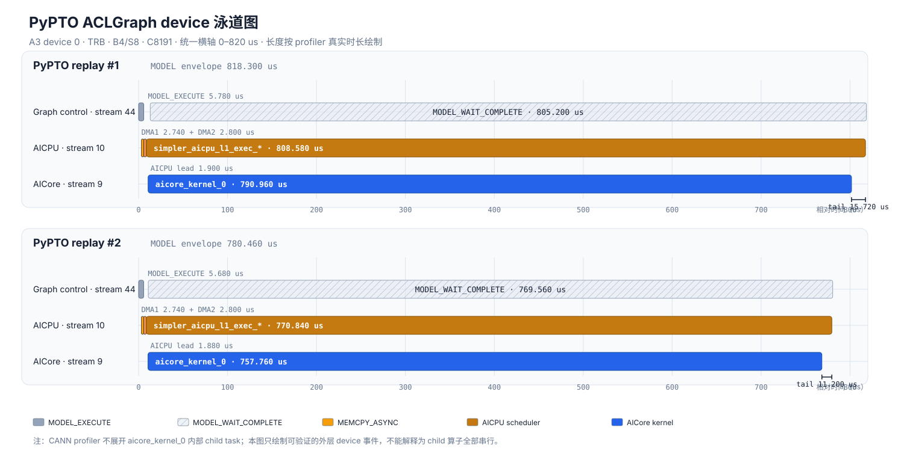

# Native 与 PyPTO 算子级 Profiling 对比分析

## 1. 结论

这份历史诊断 profile 中，PyPTO 比 Native 慢的首要原因不是 Python enqueue，也不是
PyPTO 做了更多 AICore 串行工作，而是 PyPTO 的单个外层 AICore kernel 没有在可观测
执行区间中兑现 Native 双流已经获得的并行收益。

两轮诊断 replay 的平均差距可以闭合为：

```text
PyPTO MODEL - Native MODEL
= 49.680 us  AICore 净差距
+ 15.350 us AICPU 相对 AICore 的 envelope 增量
+  3.600 us MODEL 外围净差
= 68.630 us
```

其中 `49.680 us` 的 AICore 净差距又可以闭合为：

```text
PyPTO AICore - Native compute span
= -47.410 us PyPTO 相对 Native 两流串行 kernel 总和节省的工作
+ 117.260 us Native 双流 overlap
-  20.170 us Native compute span 内的 global idle
=  49.680 us
```

因此，当前 profile 支持的优化优先级是：

1. 首先让 PyPTO 内部依赖无关的分支真正并行，目标是取回至少约 `50 us`；
2. 再压缩平均约 `15 us` 的 AICPU completion envelope；
3. 最后处理约 `3.6 us` 的 MODEL 外围净差，以及尚不能确认方向和字节数的两次 DMA。

这份 profile 不能给出 PyPTO 每个 child task 的真实耗时。CANN profiler 只看到了
`simpler_aicpu_l1_exec_*` 和一个 `aicore_kernel_0`；下面对 Native 的 38 个算子可以逐项
列举，但把这些算子强行一一映射成 PyPTO child 耗时会制造不存在的证据。

## 2. 测试口径

| 项目 | 值 |
| --- | --- |
| Device | A3 device 0 |
| Runtime | TRB（`tensormap_and_ringbuffer`） |
| 调用模式 | ACLGraph fixed captured binding |
| 拓扑 | TP1、B4/S8、ratio4、context position 8191 |
| 诊断顺序 | Native #1 → PyPTO #1 → PyPTO #2 → Native #2 |
| taskQueue | `TASK_QUEUE_ENABLE=1` |
| profiler | torch_npu Level1，CPU + NPU，PipeUtilization |

本进程先执行正式 `20 warmup + 100 sample` ABBA benchmark，之后额外执行两轮诊断
ABBA。诊断 profiler 中的两轮不进入正式 percentile。

正式样本为：

| 指标 | Native | PyPTO | PyPTO - Native |
| --- | ---: | ---: | ---: |
| device p50 | `704.220 us` | `769.010 us` | `+64.790 us` |
| device p90 | `711.950 us` | `780.876 us` | `+68.926 us` |
| device p99 | `722.980 us` | `790.904 us` | `+67.924 us` |
| Host replay p50 | `18.721 us` | `18.856 us` | `+0.135 us` |

Host replay p50 只差 `0.135 us`，不足以解释 device p50 的 `64.790 us` 差距，所以
瓶颈位于 taskQueue consumer 之后的 device 执行区间。

## 3. 两轮 MODEL 与执行区间

| 指标（us） | round 1 | round 2 | 两轮均值 |
| --- | ---: | ---: | ---: |
| Native MODEL envelope | `742.220` | `719.280` | `730.750` |
| PyPTO MODEL envelope | `818.300` | `780.460` | `799.380` |
| PyPTO - Native | `76.080` | `61.180` | `68.630` |
| 相对 Native | `+10.25%` | `+8.51%` | `+9.39%` |

`MODEL envelope` 从对应 `MODEL_EXECUTE` 开始到 `MODEL_WAIT_COMPLETE` 结束。两轮波动
较明显，尤其 Native 的 O projection，因此正式性能结论必须继续使用 100 样本结果；
这里的两轮只用于结构归因。

## 4. 差距闭合

| 指标（us） | round 1 | round 2 | 两轮均值 |
| --- | ---: | ---: | ---: |
| Native 两流 kernel 串行和 | `831.980` | `811.560` | `821.770` |
| Native 双流 overlap | `115.780` | `118.740` | `117.260` |
| Native interval union | `716.200` | `692.820` | `704.510` |
| Native global idle | `19.860` | `20.480` | `20.170` |
| Native compute span | `736.060` | `713.300` | `724.680` |
| PyPTO `aicore_kernel_0` | `790.960` | `757.760` | `774.360` |
| PyPTO AICore - Native 串行和 | `-41.020` | `-53.800` | `-47.410` |
| PyPTO AICore - Native compute span | `+54.900` | `+44.460` | `+49.680` |
| PyPTO AICPU envelope 增量 | `17.620` | `13.080` | `15.350` |
| MODEL 外围净差 | `3.560` | `3.640` | `3.600` |
| 最终 MODEL 差距 | `76.080` | `61.180` | `68.630` |

平均 MODEL 差距按直接组成项划分：

- AICore 净差距：`49.680 us`，占 `72.39%`；
- AICPU envelope：`15.350 us`，占 `22.37%`；
- MODEL 外围净差：`3.600 us`，占 `5.25%`。

这里不能把 `117.260 us` overlap 单独解释成最终可回收收益，因为 PyPTO 已经通过融合、
task 消除或不同调度减少了 `47.410 us` 的串行工作，而且 Native 自身还有 `20.170 us`
global idle。三个量必须按闭合公式共同解释。

## 5. Native 阶段级分解

下表均为两轮均值。`kernel sum` 是阶段内所有 stream 的耗时相加；`union` 是区间并集；
`overlap = kernel sum - union`；`idle = span - union`。不同阶段基本首尾相接，阶段 span
之和与完整 Native compute span 的微小差异来自阶段边界空洞。

| Native 阶段 | kernel sum | overlap | union | idle | span | 占 Native span |
| --- | ---: | ---: | ---: | ---: | ---: | ---: |
| MLA prolog | `264.500` | `89.490` | `175.010` | `5.450` | `180.460` | `24.90%` |
| Indexer Q/K prepare | `129.910` | `17.610` | `112.300` | `5.540` | `117.840` | `16.26%` |
| Compressor + index select + sparse attention | `201.880` | `10.160` | `191.720` | `8.060` | `199.780` | `27.57%` |
| Inverse RoPE + O projection | `225.480` | `0.000` | `225.480` | `0.110` | `225.590` | `31.13%` |

Native 总 overlap 的来源为：

- MLA prolog：`89.490 us`，占全部 overlap 的 `76.32%`；
- Indexer Q/K prepare：`17.610 us`，占 `15.02%`；
- Compressor/index select：`10.160 us`，占 `8.66%`；
- O projection：没有跨流 overlap。

MLA prolog 是最重要的并行区。辅助流上的 SWA `ScatterNdUpdateV2` 与主流
32768-wide `QuantBatchMatmulV3` 单段就分别隐藏 `52.300/53.560 us`。因此，若 PyPTO
内部 DAG 把这两支错误串行化，仅这一处就足以解释绝大部分 AICore 净差距。

## 6. Native 最大的单算子

| 排名 | 语义算子 | round 1 | round 2 | 均值 | Native 串行和占比 |
| ---: | --- | ---: | ---: | ---: | ---: |
| 1 | `oproj.wo_b` | `114.380` | `103.220` | `108.800` | `13.24%` |
| 2 | `oproj.wo_a` | `107.280` | `90.120` | `98.700` | `12.01%` |
| 3 | `mla.wq_b_quant_matmul` | `73.000` | `74.420` | `73.710` | `8.97%` |
| 4 | `mla.swa_cache_scatter` | `60.740` | `63.080` | `61.910` | `7.53%` |
| 5 | `csa.sparse_attention` | `61.160` | `60.940` | `61.050` | `7.43%` |
| 6 | `csa.kv_compressor` | `59.080` | `59.900` | `59.490` | `7.24%` |
| 7 | `indexer.kv_compressor` | `49.900` | `51.240` | `50.570` | `6.15%` |
| 8 | `indexer.quant_lightning` | `40.600` | `40.760` | `40.680` | `4.95%` |
| 9 | `mla.wkv_quant_matmul` | `31.580` | `30.480` | `31.030` | `3.78%` |
| 10 | `mla.wq_a_quant_matmul` | `31.040` | `30.780` | `30.910` | `3.76%` |

O projection 的 `wo_a + wo_b` 平均串行耗时为 `207.500 us`，是最大的单阶段热点；
但这段没有 Native 双流 overlap，所以它解释的是双方都必须承担的计算成本，不直接证明
PyPTO 相对 Native 的差距来自 O projection。并且这份 profile 早于最终保留的 `wo_b`
tile-major pack 和 projection submit 顺序调整，不能用它评价最终版本的 O projection。

Native 38 个算子的完整逐项数据见 `native_operator_breakdown.csv`。语义名称根据
`kernel_details.csv` 的执行顺序、stream、输入输出 shape，以及 Native
`AscendDSAImpl` 调用图映射；原始 profiler 名称和数值不做修改。

## 7. Native 按 profiler 类型汇总

| profiler 类型 | 两轮平均 kernel sum | Native 串行和占比 |
| --- | ---: | ---: |
| `QuantBatchMatmulV3` | `154.270 us` | `18.77%` |
| `MatMulV2` | `130.810 us` | `15.92%` |
| `Compressor` | `110.060 us` | `13.39%` |
| `TransposeBatchMatMul` | `98.700 us` | `12.01%` |
| `ScatterNdUpdateV2` | `86.240 us` | `10.49%` |
| `SparseAttnSharedkv` | `61.050 us` | `7.43%` |
| `VllmQuantLightningIndexer` | `40.680 us` | `4.95%` |
| `InplacePartialRotaryMul` | `35.750 us` | `4.35%` |
| `DynamicQuant` | `26.510 us` | `3.23%` |
| 其余类型 | `77.700 us` | `9.46%` |

这些是资源工作量之和，不是关键路径贡献；特别是双流上的算子会彼此重叠，不能直接把
类型汇总值相加后与 MODEL latency 比较。

## 8. PyPTO 外层可观测分解



该图将两轮 replay 都按各自 `MODEL_EXECUTE` 起点归一化，并使用完全相同的
`0–820 us` 横轴，因此两轮 bar 长度可以直接比较。图中只绘制 profiler 确实记录的
MODEL control、两次 DMA、AICPU scheduler 和 AICore kernel；`aicore_kernel_0` 内部
child task 不可见。

| 指标 | PyPTO #1 | PyPTO #2 | 两轮均值 |
| --- | ---: | ---: | ---: |
| AICPU scheduler | `808.580 us` | `770.840 us` | `789.710 us` |
| `aicore_kernel_0` | `790.960 us` | `757.760 us` | `774.360 us` |
| AICPU 比 AICore 提前 | `1.900 us` | `1.880 us` | `1.890 us` |
| AICore 结束后的 AICPU tail | `15.720 us` | `11.200 us` | `13.460 us` |
| AICPU envelope 相对 AICore增量 | `17.620 us` | `13.080 us` | `15.350 us` |

AICPU 和 AICore 大部分时间重叠，不能把二者耗时相加。真正进入 MODEL 差距的是 AICPU
相对 AICore 多出来的 envelope，而不是完整的 `789.710 us` scheduler duration。

每次 PyPTO replay 前还可见两个 `MEMCPY_ASYNC`，两轮 duration 为
`2.740/2.800 us`，整体 wall span 约 `5.6 us`。但 trace 没有方向和 byte count，且
ACL-to-NPU flow parser 报过关联告警，所以“它们就是 `LaunchKernelWithHostArgs` 的 H2D
tiling”只能作为高概率推断，不能作为已验证事实，也不能和 `3.600 us` 外围净差机械相加。

## 9. 当前证据不能回答什么

1. 不能回答 PyPTO 的 `q_proj`、compressor、indexer、sparse attention、`wo_a/wo_b`
   各自真实耗时，因为外层 profiler 不展开 38 个 PyPTO top-level submit 的 child 时间线。
2. 不能证明 PyPTO child 全部串行；只能证明当前外层 AICore 区间没有兑现足以匹配 Native
   的并行收益。
3. 不能评价最终实现。该 profile 早于 tile-major weight pack、projection group
   逆序提交以及 `idx_qr_dequant_rope` 融合。
4. 不能外推到动态 tensor 地址/scalar、B8/B12/B16、HBG、完整 Engine 或多层模型。

若要获得真正一一对应的 PyPTO child 对比，需在 borrowed-device L1 ABI 中增加不会改变
调度语义的 child start/end 时间戳或 PMU/DFX buffer，并确保记录开销可单独测量和关闭。
在这项能力存在前，最可信的优化验证方式仍是：保持相同 correctness gate，对单一 DAG/
kernel 变更做 fresh-process ABBA A/B，并用外层 AICore span 判断收益。

## 10. 数据来源与复核

- `profiler_output/kernel_details.csv`：80 行 kernel；顺序为 38 个 Native、2 个 PyPTO
  外层 kernel、2 个 PyPTO 外层 kernel、38 个 Native。
- `profiler_output/task_time.csv`：四组 `MODEL_EXECUTE`/`MODEL_WAIT_COMPLETE` 边界、
  event、DMA 和 device task。
- `profiler_output/trace_view.json`：875 个 timeline event，用于复核 stream 与 Host marker。
- `benchmark_run.txt`：正式 100 样本结果、正确性门禁和 profiler 配置。
- `gap_decomposition.csv`：本分析中的差距闭合数据。
- `native_operator_breakdown.csv`：Native 38 个可见算子的逐项数据。
- `pypto_device_swimlane.svg`：PyPTO 两轮 replay 的等比例 device 泳道图。
- `generate_pypto_swimlane.py`：从原始 `task_time.csv` 重建泳道图的确定性生成器。

计算使用十进制定点数读取 profiler 的巨大绝对时间戳，避免 binary float 消减误差。
以下恒等式已逐轮复核：

```text
Native compute span = kernel sum - overlap + global idle
MODEL gap = AICore gap + AICPU envelope increment + outer residual
```
